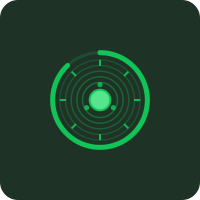
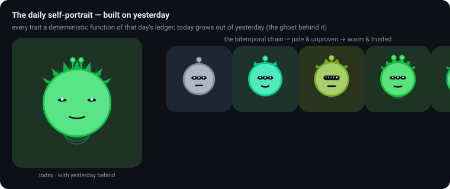
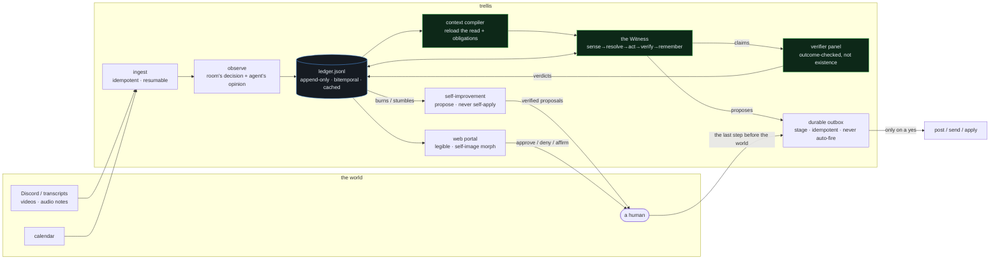
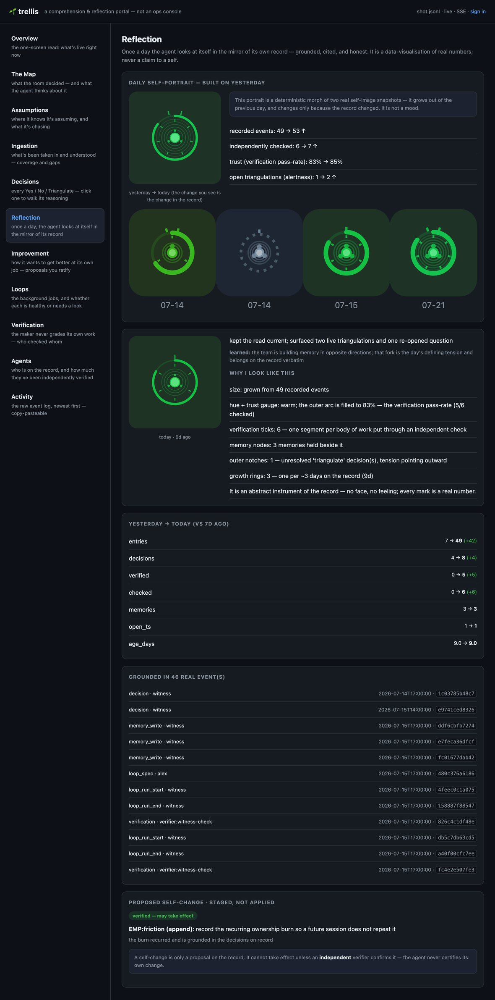
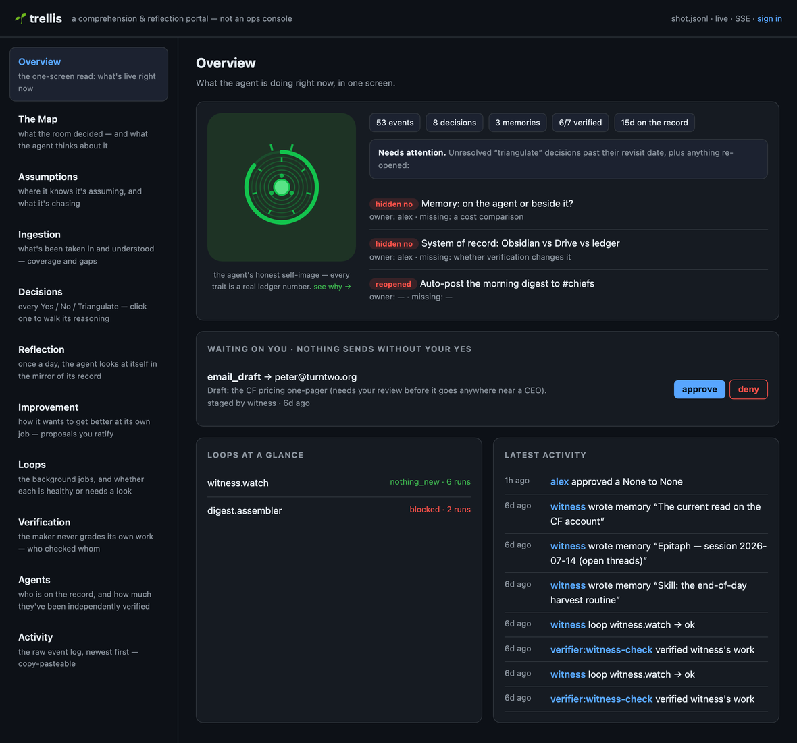
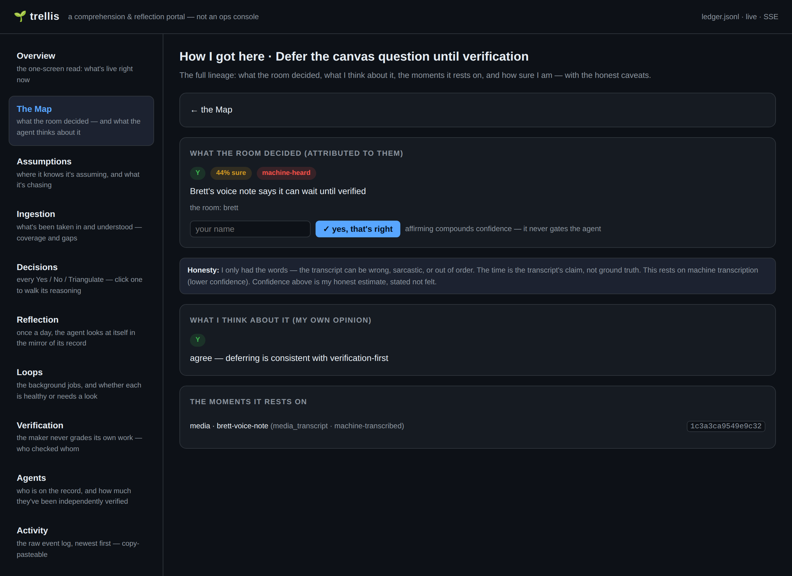

# trellis

**Most AI-agent frameworks are built to get tasks done. trellis is built to be
*trusted* — so the longer it runs, the more you can rely on it, not less.**

In plain terms: it's an **accountable, auditable agent** that keeps a dated
notebook of every decision, has its work checked by an independent verifier
(never itself), knows what information is stale, refuses to pretend it's done
when it isn't, and never sends or changes anything without your yes. It's the
difference between a fast intern who says "done!" (maybe) and forgets by
tomorrow, and a trustworthy junior colleague who keeps receipts and gets more
useful the longer they work with you. → **New here? Read [WHAT-THIS-IS.md](WHAT-THIS-IS.md) first.**

<p align="center">
  <a href="https://github.com/ClumsyWizardHands/trellis/actions/workflows/ci.yml"></a>
  
  
  
  
  
</p>

### The agent draws itself — and the drawing is honest (and has no face)

Every mark in this self-image is a deterministic function of a real number in the
agent's ledger. It is **not** a creature and **not** a mascot — a face that emotes
would be the soul leaking back in through the picture (the same embodiment the
harness refuses everywhere else). It's an **abstract instrument of the record**:
concentric growth rings (age), a filled arc gauge (verification pass-rate),
tick-segments (bodies of work checked), outward notches (unresolved triangulations),
and a hue (trust). Same record → same instrument. It changes only because the
record changed.

<p align="center">
  
  &nbsp;
  &nbsp;
  &nbsp;
</p>
<p align="center"><sub><b>newborn</b> (pale, empty dashed track — trust unearned) · <b>learning</b> (the arc begins to fill) · <b>trusted</b> (warm, the trust gauge nearly full, rings accrued) · <b>wary</b> (cool — pass-rate dropped; outward notches for 4 unresolved triangulations)</sub></p>

And each day it draws itself **again**, building on yesterday — a deterministic
morph over the bitemporal chain of self-image snapshots. It grows out of the
previous day (the ghost behind it); it changes only because the record changed.
Not "what I feel like today" (that would be the soul leaking back in through the
picture) — the record paints it.

<p align="center">
  
</p>

### The whole thing at a glance



### The working loop — the unit of work is a *recorded, checked judgment*


### How it looks and functions — a comprehension-and-reflection portal

The UI is **not** an operations console. The work lives in Discord and email;
this surface exists to make the invisible (the verifier agents, the loops, the
coordination you never see in Discord) legible in plain terms — and to be the
room where the agent reflects on itself each day. It's a **side nav of dedicated,
self-explaining pages** — every term defines itself in place, no insider
vocabulary. Its heart is the **Reflection** page: the agent's daily self-image
beside yesterday's, every trait tied to real **cited** events, the day's deltas,
and any change it wants to make to itself going through an independent checker — a
proposal, not a vibe.

<p align="center">
  
</p>

<sub>The <b>Reflection</b> page: today's self-image (a deterministic drawing of
real ledger numbers) beside yesterday's, the cited "why I look like this", the
day's deltas, and a self-change staged as a <b>verified</b> proposal. Vision →
[`docs/ROADMAP-UI-SPINE.md`](docs/ROADMAP-UI-SPINE.md) · why it changed →
[the cognitive lineage](docs/lineage/2026-07-15-ui-comprehension-reflection.md).</sub>

<p align="center">
  
</p>

<sub>The <b>Overview</b>: the self-image and headline numbers, the <b>attention
rail</b> (unresolved triangulations past their revisit date + anything re-opened),
what's waiting on your yes, loop health, and the latest story. A decision on the
<b>Decisions</b> page <b>opens up</b> into a WALK — its verdict, the named points
of view, and the lineage upstream toward the EMP.</sub>

### The contemplative backdrop — a mind that maps what it understands

Beyond answering in the moment, trellis does the *unseen work*: it takes in the
team's record (transcripts, the daily Discord downloads, Brett's videos, audio
notes), and **understands** it — tracking not just *what* was decided but *how the
room got there*. Each decision it finds becomes **two linked nodes**: what the room
decided (attributed to them, confidence stated, "the transcript may be wrong")
and the agent's **own opinion** about it. One click shows you exactly **how it got
there** — the cited moments, the confidence, the honest caveats — and a one-click
"yes, that's right" that *compounds* trust without ever gating the agent.

<p align="center">
  
</p>

<sub>The one-click <b>"How I got here"</b>: what the room decided (attributed, with
confidence and a <i>machine-heard</i> flag), the affirm button that compounds but
never gates, the honest caveats (<i>"I only had the words"</i>), the agent's
separate opinion, and the source moments it rests on. Its worry made watchable: an
<b>Assumptions &amp; Curiosities</b> board where overdue questions light up and a
<b>dry streak</b> flags "keeps looking, nothing moves" — because "I searched" is
structurally never "I understand." Design → [`docs/PLAN-contemplative-ingestion.md`](docs/PLAN-contemplative-ingestion.md).</sub>

### It reloads what it knew before it forms an opinion

The hardest failure in an agent that's supposed to *understand over time*: forming
each opinion on the latest batch alone, having written a "current read" it never
reads back. trellis's **context compiler** (`context.py`, D24) fixes that — before
the Witness resolves anything, a deterministic pass **reloads the prior read**, the
active decisions on the subject, the **open obligations as full objects** (not a
count), recent corrections, and verification outcomes — and records a
**ContextManifest**: exactly what the model saw, and what was excluded and why. The
opinion is formed over reconstructed state, and the compilation itself is auditable.

### It recursively improves itself — and never changes itself alone

trellis is built to get *better at its own job* over time (D23). It watches its own
record for stumbles — a silent-failure, a self-refuted claim, a question it keeps
searching and never resolves, a human correcting its read — and turns each into a
**dread-linted friction note** the next prompt reads ("where did I get confused
today?"). It keeps a navigable **skill estate** so "is there already a skill for
this?" dedups before it proposes a new one. And any change it wants to make to
itself — an EMP edit, a new skill, a process tweak — is a **staged, independently
verified proposal that a human ratifies**. A skill from an untrusted source (a
YouTube short) is a *default-no* that must state its supply-chain reasoning. The
agent thinks about improving itself constantly; it can't change itself without an
independent verified verdict **and** your yes. That's "self-improving" made honest.

<details>
<summary><b>v1 — the operations console we corrected (and why it was wrong)</b></summary>

<br/>The first cut shipped as a single-page ops dashboard: an approvals inbox, a
health board, a trust percentage, insider vocabulary. It was the market's generic
control-plane genre — and wrong in an instructive way. It built a place to
*operate* the agent when the whole point is to *understand* it (the exact failure
the founding brief warned against: "people don't know what it means"). Kept here
as the anti-example that produced the reframe above — anti-examples are the fuel.
The portal above (`web/app.py`, FastAPI + HTMX + SSE over the JSONL ledger) is the
built replacement.
</details>

> 📊 **Full picture book:** [`docs/VISUAL-TOUR.md`](docs/VISUAL-TOUR.md) — the
> bitemporal ledger, the verifier quorum, the loop/pass state machines, the
> stage-don't-fire sequence, the adversarial convergence, and the self-image
> mapping, all as diagrams.

---

**An agent harness that is a trellis, not a soul.**

A trellis is infrastructure a living thing grows on. It is not the plant, it does
not pretend to be the plant, and it holds shape when the plant fails. This is a
harness for agents whose job is **contextual understanding and principled
opinion** — not task completion — built from eleven months of recorded agent
failures and triangulated against the strongest harnesses in the field as of
July 2026 (pi, OpenClaw, Hermes, the Claude Agent SDK, Letta).

It is the executable companion to *CF Discord Agent.md* — the failure-intelligence
dossier and baby EMP compiled 2026-07-15. That document says what the team cannot
forgive an agent for getting wrong. This repository is those unforgivables turned
into type errors.

### Install it on your machine (clone or unzip — no git required)

```
pip install -e .     # zero-dependency core
trellis init         # scaffold .env (+ a generated portal secret) and state/
trellis doctor       # honest readiness check: what's configured, what's reachable
trellis demo         # a full witness cycle, offline, no accounts
```

Then pick a model seat (`TRELLIS_PROVIDER` = `local` for Gemma/Ollama, `openai`, or
`claude`), point it at your own surfaces (Obsidian vault, your own Discord bot), and
re-run `trellis doctor`. The `claude` seat runs on your **Claude Max subscription** (via
`claude login` / `claude setup-token`, no API key needed) or an `ANTHROPIC_API_KEY` if you
prefer per-token billing. A fresh install is **inert** — it touches nothing but the
offline demo until you configure a surface. Full walkthrough (and a section for AI
assistants setting it up): **[docs/SETUP.md](docs/SETUP.md)**.

For development:

```
python3 -m pytest           # the acceptance suite — live count on the CI badge above
python3 stress/stress_test.py   # 10 adversarial scenarios, evidence-logged
```

---

## The five refusals

Everything else in this repo is detail. These five are structural — the code
raises, it doesn't remind:

| # | Refusal | Where | The burn it answers |
|---|---------|-------|---------------------|
| 1 | **No silent failure.** Every loop run ends in a typed outcome, written in a `finally`. A run that says nothing is recorded as `protocol_violation` — by the harness, about the run. | `loops.py` | "Claude failed silently and has been spinning for four hours." — Clare, 2026-06-11 |
| 2 | **No self-certification.** A completion claim carries evidence a checker can open; the verifier must be a different identity. Maker == verifier raises. And a pass means the **outcome** was checked — evidence *existence* is `PRECONDITIONS_PASSED`, never `VERIFIED`. | `verify.py` | "A self audit is not an audit." — Brett, 2026-03-13 |
| 3 | **No soul.md.** Identity is an EMP grounded in observable behavior. The loader refuses soul/persona/character files by name; an embodiment linter catches "I can see / I feel / my eyes." | `emp.py` | "The original sin: the agent gaslighting itself and us that it is something it is not." — the June 2026 paradigm doc |
| 4 | **No naked `now()`.** All state is bitemporal (event-time + write-time). Retrieved items are age-annotated so stale data *looks* stale. Naive timestamps are refused. Newer supersedes older, out loud. | `clock.py`, `ledger.py` | "A conversation from April minted today reads June 10." — loop-provenance audit, 2026-06-10 |
| 5 | **No auto-fire.** Every outbound action stages for a named human; the staging agent cannot approve itself; no bypass flag. The outbox is **durable** — it survives a restart and fires **idempotently**, so a crash can't lose your yes or send the same thing twice. | `stage.py` | "Nothing is ever sent, posted, or applied automatically." — DAILY-EMPIRE-PROTOCOL, 2026-07-15 |

## What lives here

**The spine — the record and its refusals:**

```
trellis/
├── clock.py       time: bitemporal stamps, half-life staleness (future-dated
│                  data is QUARANTINED, not "fresh"), heartbeat-vs-cron,
│                  schedules you can VERIFY ran
├── ledger.py      the spine: append-only JSONL, event-time + write-time, author
│                  required, supersession-not-deletion, as_of() time travel, and
│                  a rebuildable read-cache so the record compounds without slowing
├── identity.py    one definition of "the same actor" / "blank"; the ASCII-identity
│                  allowlist that closes homoglyph self-approval at every gate
├── emp.py         identity: EMP (Ends/Means/Principles/…), soul refusal, the
│                  embodiment + dread lints, the functional mortality posture
├── decisions.py   the atomic Y/N/T record with EMP lineage; anti-fork on the
│                  question-key (two live answers to one question is impossible);
│                  T needs ≥3 POVs + owner + revisit; unresolved Ts → HIDDEN NOS
├── navigate.py    memory is navigation: WALK (read-only) / REOPEN / DECIDE, the
│                  resolved-head cache, title search — you never silently re-decide
├── surfaces.py    threads as substrate; privacy lives in the (agent,surface,
│                  thread,human) key — a DM can't leak into a channel
├── passes.py      agent-to-agent typed Pass files with a required ask (the
│                  turd-drop is a type error), tracked lifecycle, overdue detection
├── loops.py       bounded loops; a typed outcome in a `finally`; if the store is
│                  down it fails LOUD (never reports success on an unrecorded run)
├── verify.py      the checker's seat: existence is PRECONDITIONS_PASSED, an outcome
│                  predicate earns VERIFIED; RuleVerifier + ModelVerifier; trust
│                  compounds per maker; maker == verifier raises
├── panel.py       the haiku-verifier panel: N independent lenses, refute-by-default
│                  quorum — diversity, not a chorus
├── stage.py       the DURABLE outbox: event-sourced, reconstructs on restart,
│                  idempotent fire (no double-send on a crash), UNKNOWN + reconcile
├── memory.py      memory beside the agent: synthesis-test write gate, fold-not-
│                  clobber, flush-before-compact, session epitaphs
├── prompt.py      the standing prompt (<1,200 tokens): clock, maps not content,
│                  staleness legend, and the day's harvested burns
```

**The contemplative backdrop — a mind that maps what it understands:**

```
├── sources.py     the ingestion spine: idempotent by identity + content-hash,
│                  resumable across a crash (two-phase started/complete markers)
├── ingest.py      Discord/calendar → ledger, bitemporally; position_history —
│                  recall-with-receipts a human structurally can't match
├── observe.py     a found decision is TWO linked nodes: the room's (attributed,
│                  confidence-tagged) and the agent's own opinion; provenance FLOORs
├── vault.py       the Obsidian vault as the ledger's reconciled face — a human's
│                  edit is detected and folded in as an attributed write
├── curiosity.py   open questions with teeth: a dry seek is not understanding;
│                  closing needs a pursued map-move, not "I searched"
├── reflect.py     the daily reflection ritual: a grounded self-image + any
│                  self-change staged as an independently-VERIFIED proposal
├── context.py     the context compiler: reload the prior read + open obligations +
│                  corrections before forming an opinion, with an auditable manifest
├── selfimprove.py the self-improvement engine: a skill estate + typed proposals —
│                  the agent proposes its own repair, and never applies it alone
├── agent.py       the Witness: sense → resolve → act → verify → remember, now
│                  over COMPILED context, changing its own mind AUTONOMOUSLY as a
│                  logged supersession (D33); Y/N/T; [] is a legitimate answer
├── panel.py …     convene_verification (verify.py) runs the cheap Haiku seat on
│                  every decision/reflection write — REFUTED marks it contested,
│                  escalates, and drops it from the next cycle's trusted read (D35)
└── providers/     model seats: mock (deterministic), claude_sdk (first-class,
                   optional), openai_compat (local — Gemma/Hermes via Ollama, stdlib);
                   factory.py seats a separate cheaper VERIFIER (maker≠verifier, D34)
```

**The live surface — isolated Discord, sessions, the staged send path (D30–D38):**

```
├── isolation.py     trellis touches only its OWN surfaces: its own identity +
│                    separate READ/ACT allowlists; a shared bridge's other-agent
│                    traffic is dropped on read, refused on act (empty = inert)
├── registry.py      a stable Discord snowflake → canonical id, so a rename can
│                    never poison attribution (auto-registers, never merges two humans)
├── ingest.py        the idempotent Discord→Ingestor bridge: a re-poll is a no-op,
│                    an allowlisted channel implies its threads, DMs stay scoped
├── sessions.py      every conversation as a session (DM per-interlocutor, threads,
│                    channels) — the portal's legible, owner-only Session Log
├── executor.py      the send path: CAN post, never on its own — guard_act-gated,
│                    only ever the callable Outbox.fire invokes after a durable yes
├── discord_gateway  the in-Discord approval gesture: a reaction routes to the same
│                    authenticated, maker≠approver path — and ONLY the owner's counts
├── runner.py        the local always-on tick/run (on with your machine, not a
│                    server): ledger-derived daily budget, orphan-start sweep
└── scheduler.py     scheduling as VERIFIABLE ledger state — a restart reconstructs
                     what is scheduled and whether it actually fired
```

**The comprehension portal** (`web/`, an optional extra): `app.py` + `views.py`
(FastAPI + HTMX + SSE over the JSONL ledger), `glyph.py` + `selfportrait.py` (the
honest self-image and its daily, deterministic morph). Config + entrypoints:
`config.py` (`.env`), `auth.py` (signed-session approver), `cli.py`
(`init` / `doctor` / `demo` / `web` / `run` / `tick` / `discord`).

Companion documents:

- **DECISIONS.md** — every architectural decision, triangulated ≥3×, dated,
  recency-checked, superseded-not-edited. Start here to argue with the design.
- **LINEAGE.md** — the archaeology: eleven months of agent builds on this
  machine, what each one taught, and which lesson landed where in this code.
- **ACCEPTANCE.md** — the ten unforgivables from the dossier mapped to the
  tests that enforce them.
- **STRESS-REPORT.md** — evidence from the adversarial suite (regenerate with
  `python3 stress/stress_test.py`; deterministic seed, reproducible numbers).

## What kind of agent this is for

Not a taskmaster. The shipped shape is the **Witness** (`agent.py`): it ingests
a surface — channels, transcripts, a corpus — holds an EMP-grounded *read* of
what is happening, and puts **opinions on the record as Y/N/T decisions with
lineage**: including *No*, and including *Triangulate* with a named missing
piece, an owner, and a revisit date. Its stopping condition is "my read is
current and my opinions are on the record" — never "the task list is empty."
An empty opinion set is a loud `nothing_new`, not manufactured usefulness.

Task execution can be attached to a trellis. It just isn't the identity.

## Model seats

The core never imports a vendor SDK. Three seats ship:

```python
from trellis.providers.mock import MockProvider            # tests, dry runs
from trellis.providers.claude_sdk import ClaudeSDKProvider  # pip install claude-agent-sdk
from trellis.providers.openai_compat import OpenAICompatProvider
# local models — Clare's stack:
gemma = OpenAICompatProvider("http://localhost:11434/v1", "gemma3:12b")
```

Adapters fail **loud** (`ProviderUnavailable`), never silent — a degraded
auxiliary model that keeps nodding is a recorded failure mode, not a fallback
strategy. For running trellis's refusals inside a full Claude Agent SDK agent
(hooks at PreToolUse / Stop / SessionEnd), see `docs/claude-sdk.md`.

## Sixty seconds of taste

```python
from trellis import *
from trellis.clock import TimeGround
from trellis.ledger import Ledger

ground = TimeGround()
ledger = Ledger("state/ledger.jsonl", ground)

# time that cannot lie
stamp = ground.stamp()                       # event-time AND write-time
ground.annotate("Brett prefers X", april_dt, volatility="position")
                                             # "[expired · 84d ago · 2026-04-22] …"

# a decision that cannot be a disguised maybe
Decision(subject="memory on-agent vs beside", verdict=Verdict.T, ...)
# → IncompleteTriangulationError: T requires >=3 POVs, an owner, a revisit time

# a pass that cannot be a turd-drop
Pass(sender="peter", receiver="atlas", ask="thoughts?", context=...)
# → TurdDropError: state what the receiver should DO, by when, what done looks like

# a loop that cannot fail silently
with LoopRun(spec, registry, actor="witness:a") as run:
    ...                                      # crash, wander off, whatever —
                                             # an outcome is written regardless

# work that cannot grade itself
RuleVerifier("witness:a").verify(claim_by_witness_a)
# → SelfCertificationError: a self-audit is not an audit

# a "pass" that means the OUTCOME held, not that a file exists
verifier.verify(claim_backed_only_by="opaque://uncheckable")
# → INSUFFICIENT (existence alone is PRECONDITIONS_PASSED, never VERIFIED)

# an outbound action that survives a crash without firing twice
outbox.fire(action_id, executor)   # records a firing intent BEFORE the world;
# a retry after a crash → DoubleFireError, never a second send

# a self-improvement the agent proposes but cannot apply alone
engine.can_take_effect(proposal_id)
# → UnverifiedProposalError until an independent verdict AND a human's yes
```

## What this is not

- Not a chat gateway. It now carries its **own** isolated Discord surface —
  idempotent ingestion, per-interlocutor sessions, and a guard_act-gated send
  path (D30–D38) — but the core stays surface-agnostic (any source that produces
  `Event`s and consumes staged actions composes just as well).
- Not a skill marketplace, not auto-installed anything (see DECISIONS.md W1 —
  the 2026 supply-chain record is why).
- Not autonomous outbound. The send path is built and CAN post, but every
  outbound still stages for the owner's yes — the yes just happens in Discord now
  (a ✅ reaction, D38). Refusal #5 / W3 stand: no auto-fire, no bypass.
- Not a memory database. Files, beside the agent. The agent dies; the record
  survives.

---

*Built 2026-07-15 from the corpus in `~/atlas`, the builds on `~/Desktop`, and the
July 2026 harness field; hardened through 2026-07-21 against four external audits
(infrastructure/reliability, context-engineering, an architecture pass, and a
code-sanity pass), with the highest-stakes changes independently re-verified by a
separate agent — the harness's own maker≠verifier doctrine, applied to itself. The
go-live layer (D31–D38) then wired it for a private Discord: isolated ingestion,
per-interlocutor sessions, broad Haiku verification, the autonomous mind-change, a
local always-on runner, and a staged send path whose approval happens in Discord —
all code-complete and test-covered, awaiting only a trellis-owned bot token to run
live (see [docs/GO-LIVE-CHECKLIST.md](docs/GO-LIVE-CHECKLIST.md)). 38 triangulated
decisions, the acceptance suite + 10 adversarial scenarios on CI, zero runtime
dependencies in the core.*
