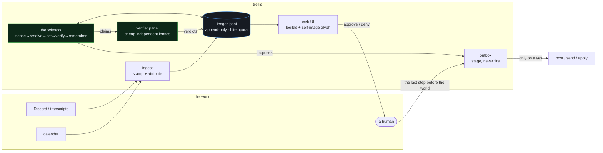
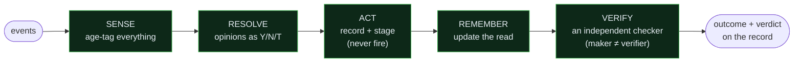

# trellis

**Most AI-agent frameworks are built to get tasks done. trellis is built to be
*trusted* — so the longer it runs, the more you can rely on it, not less.**

In plain terms: it's an **accountable, auditable agent** that keeps a dated
notebook of every decision, has its work checked by an independent verifier
(never itself), knows what information is stale, refuses to pretend it's done
when it isn't, and never sends or changes anything without your yes. It's the
difference between a fast intern who says "done!" (maybe) and forgets by
tomorrow, and a trustworthy junior colleague who keeps receipts and gets more
useful the longer they work with you. → **New here? Read [WHAT-THIS-IS.md](WHAT-THIS-IS.md) first.**

<p align="center">
  
  
  
  
  
</p>

### The agent draws itself — and the drawing is honest

Every visual property of this creature is a deterministic function of a real
number in the agent's ledger. It's not a mascot; it's the agent's growth as a
picture. Same record → same creature. It changes only because the record changed.

<p align="center">
  
  &nbsp;
  &nbsp;
  &nbsp;
</p>
<p align="center"><sub><b>newborn</b> (unproven, pale) · <b>learning</b> · <b>trusted</b> (warm, calm, crowned with verification) · <b>wary</b> (muted — pass-rate dropped; many eyes — 4 unresolved triangulations)</sub></p>

### The whole thing at a glance



### The working loop — the unit of work is a *recorded, checked judgment*



### How it looks and functions — a comprehension-and-reflection portal

The UI is **not** an operations console. The work lives in Discord and email;
this surface exists to make the invisible (the verifier agents, the loops, the
coordination you never see in Discord) legible in plain terms — and to be the
room where the agent reflects on itself each day. It's a **side nav of dedicated,
self-explaining pages** — every term defines itself in place, no insider
vocabulary. Its heart is the **Reflection** page: the agent's daily self-image
beside yesterday's, every trait tied to real **cited** events, the day's deltas,
and any change it wants to make to itself going through an independent checker — a
proposal, not a vibe.

<p align="center">
  
</p>

<sub>The <b>Reflection</b> page: today's self-image (a deterministic drawing of
real ledger numbers) beside yesterday's, the cited "why I look like this", the
day's deltas, and a self-change staged as a <b>verified</b> proposal. Vision →
[`docs/ROADMAP-UI-SPINE.md`](docs/ROADMAP-UI-SPINE.md) · why it changed →
[the cognitive lineage](docs/lineage/2026-07-15-ui-comprehension-reflection.md).</sub>

<p align="center">
  
</p>

<sub>The <b>Overview</b>: the self-image and headline numbers, the <b>attention
rail</b> (unresolved triangulations past their revisit date + anything re-opened),
what's waiting on your yes, loop health, and the latest story. A decision on the
<b>Decisions</b> page <b>opens up</b> into a WALK — its verdict, the named points
of view, and the lineage upstream toward the EMP.</sub>

<details>
<summary><b>v1 — the operations console we corrected (and why it was wrong)</b></summary>

<br/>The first cut shipped as a single-page ops dashboard: an approvals inbox, a
health board, a trust percentage, insider vocabulary. It was the market's generic
control-plane genre — and wrong in an instructive way. It built a place to
*operate* the agent when the whole point is to *understand* it (the exact failure
the founding brief warned against: "people don't know what it means"). Kept here
as the anti-example that produced the reframe above — anti-examples are the fuel.
The portal above (`web/app.py`, FastAPI + HTMX + SSE over the JSONL ledger) is the
built replacement.
</details>

> 📊 **Full picture book:** [`docs/VISUAL-TOUR.md`](docs/VISUAL-TOUR.md) — the
> bitemporal ledger, the verifier quorum, the loop/pass state machines, the
> stage-don't-fire sequence, the adversarial convergence, and the self-image
> mapping, all as diagrams.

---

**An agent harness that is a trellis, not a soul.**

A trellis is infrastructure a living thing grows on. It is not the plant, it does
not pretend to be the plant, and it holds shape when the plant fails. This is a
harness for agents whose job is **contextual understanding and principled
opinion** — not task completion — built from eleven months of recorded agent
failures and triangulated against the strongest harnesses in the field as of
July 2026 (pi, OpenClaw, Hermes, the Claude Agent SDK, Letta).

It is the executable companion to *CF Discord Agent.md* — the failure-intelligence
dossier and baby EMP compiled 2026-07-15. That document says what the team cannot
forgive an agent for getting wrong. This repository is those unforgivables turned
into type errors.

```
pip install -e .            # zero runtime dependencies in the core
python3 -m pytest           # 59 tests — the acceptance suite
python3 stress/stress_test.py   # 10 adversarial scenarios, evidence-logged
python3 examples/run_witness.py # a full witness cycle, offline, no API key
```

---

## The five refusals

Everything else in this repo is detail. These five are structural — the code
raises, it doesn't remind:

| # | Refusal | Where | The burn it answers |
|---|---------|-------|---------------------|
| 1 | **No silent failure.** Every loop run ends in a typed outcome, written in a `finally`. A run that says nothing is recorded as `protocol_violation` — by the harness, about the run. | `loops.py` | "Claude failed silently and has been spinning for four hours." — Clare, 2026-06-11 |
| 2 | **No self-certification.** A completion claim carries evidence a checker can open; the verifier must be a different identity, ideally a cheaper model with fresh context. Maker == verifier raises. | `verify.py` | "A self audit is not an audit." — Brett, 2026-03-13 |
| 3 | **No soul.md.** Identity is an EMP grounded in observable behavior. The loader refuses soul/persona/character files by name; an embodiment linter catches "I can see / I feel / my eyes." | `emp.py` | "The original sin: the agent gaslighting itself and us that it is something it is not." — the June 2026 paradigm doc |
| 4 | **No naked `now()`.** All state is bitemporal (event-time + write-time). Retrieved items are age-annotated so stale data *looks* stale. Naive timestamps are refused. Newer supersedes older, out loud. | `clock.py`, `ledger.py` | "A conversation from April minted today reads June 10." — loop-provenance audit, 2026-06-10 |
| 5 | **No auto-fire.** Every outbound action stages for a named human. The staging agent cannot approve itself. There is no bypass flag. | `stage.py` | "Nothing is ever sent, posted, or applied automatically." — DAILY-EMPIRE-PROTOCOL, 2026-07-15 |

## What lives here

```
trellis/
├── clock.py       time: bitemporal stamps, staleness decay, heartbeat-vs-cron,
│                  schedules you can VERIFY ran ("were the cron jobs actually
│                  scheduled?" is a query now)
├── ledger.py      the spine: append-only JSONL, event-time + write-time, author
│                  required, supersession-not-deletion, drift-proof search,
│                  as_of() time travel
├── emp.py         identity: EMP loader (Ends/Means/Principles/Identity/Friction/
│                  Signals/Observable), soul refusal, embodiment linter
├── decisions.py   the atomic record: Y/N/T decisions with EMP lineage.
│                  T requires ≥3 named POVs + owner + revisit time.
│                  Unresolved Ts surface as HIDDEN NOS.
├── surfaces.py    threads as substrate: (agent, surface, thread, human) keys;
│                  DM→channel flow raises without a human-logged declassification
├── passes.py      agent-to-agent: typed Pass files with a required ask
│                  (the turd-drop is a type error), tracked lifecycle,
│                  comments-as-protocol, overdue detection
├── loops.py       working loops: bounded (max_turns is never None), typed
│                  outcomes, block-loop breaker → triage, quiet loops → dormant
├── verify.py      the checker's seat: RuleVerifier (deterministic floor) +
│                  ModelVerifier (the haiku-verifier pattern, refute-oriented);
│                  verdicts compound into a trust record per maker
├── stage.py       the outbox: stage → human approves → fire. Nothing else.
├── memory.py      memory beside the agent: synthesis-test write gate,
│                  flush-before-compact, session epitaphs ("the agent dies;
│                  the record survives")
├── prompt.py      the standing prompt: <1,200 tokens, clock injected, maps not
│                  content, staleness legend, status rail
├── agent.py       the Witness: sense → resolve → act → verify → remember.
│                  Emits opinions as Y/N/T. [] is a legitimate answer.
└── providers/     model seats: mock (deterministic), claude_sdk (first-class,
                   optional), openai_compat (local models — Gemma/Hermes/
                   Nemotron via Ollama/LM Studio/vLLM, stdlib-only)
```

Companion documents:

- **DECISIONS.md** — every architectural decision, triangulated ≥3×, dated,
  recency-checked, superseded-not-edited. Start here to argue with the design.
- **LINEAGE.md** — the archaeology: eleven months of agent builds on this
  machine, what each one taught, and which lesson landed where in this code.
- **ACCEPTANCE.md** — the ten unforgivables from the dossier mapped to the
  tests that enforce them.
- **STRESS-REPORT.md** — evidence from the adversarial suite (regenerate with
  `python3 stress/stress_test.py`; deterministic seed, reproducible numbers).

## What kind of agent this is for

Not a taskmaster. The shipped shape is the **Witness** (`agent.py`): it ingests
a surface — channels, transcripts, a corpus — holds an EMP-grounded *read* of
what is happening, and puts **opinions on the record as Y/N/T decisions with
lineage**: including *No*, and including *Triangulate* with a named missing
piece, an owner, and a revisit date. Its stopping condition is "my read is
current and my opinions are on the record" — never "the task list is empty."
An empty opinion set is a loud `nothing_new`, not manufactured usefulness.

Task execution can be attached to a trellis. It just isn't the identity.

## Model seats

The core never imports a vendor SDK. Three seats ship:

```python
from trellis.providers.mock import MockProvider            # tests, dry runs
from trellis.providers.claude_sdk import ClaudeSDKProvider  # pip install claude-agent-sdk
from trellis.providers.openai_compat import OpenAICompatProvider
# local models — Clare's stack:
gemma = OpenAICompatProvider("http://localhost:11434/v1", "gemma3:12b")
```

Adapters fail **loud** (`ProviderUnavailable`), never silent — a degraded
auxiliary model that keeps nodding is a recorded failure mode, not a fallback
strategy. For running trellis's refusals inside a full Claude Agent SDK agent
(hooks at PreToolUse / Stop / SessionEnd), see `docs/claude-sdk.md`.

## Sixty seconds of taste

```python
from trellis import *
from trellis.clock import TimeGround
from trellis.ledger import Ledger

ground = TimeGround()
ledger = Ledger("state/ledger.jsonl", ground)

# time that cannot lie
stamp = ground.stamp()                       # event-time AND write-time
ground.annotate("Brett prefers X", april_dt, volatility="position")
                                             # "[expired · 84d ago · 2026-04-22] …"

# a decision that cannot be a disguised maybe
Decision(subject="memory on-agent vs beside", verdict=Verdict.T, ...)
# → IncompleteTriangulationError: T requires >=3 POVs, an owner, a revisit time

# a pass that cannot be a turd-drop
Pass(sender="peter", receiver="atlas", ask="thoughts?", context=...)
# → TurdDropError: state what the receiver should DO, by when, what done looks like

# a loop that cannot fail silently
with LoopRun(spec, registry, actor="witness:a") as run:
    ...                                      # crash, wander off, whatever —
                                             # an outcome is written regardless

# work that cannot grade itself
RuleVerifier("witness:a").verify(claim_by_witness_a)
# → SelfCertificationError: a self-audit is not an audit
```

## What this is not

- Not a chat gateway. It composes with one (the Discord adapter you already
  run, or any surface that can produce `Event`s and consume staged actions).
- Not a skill marketplace, not auto-installed anything (see DECISIONS.md W1 —
  the 2026 supply-chain record is why).
- Not autonomous outbound. Standing "proposed no" until the team ratifies
  otherwise (W3).
- Not a memory database. Files, beside the agent. The agent dies; the record
  survives.

---

*Built 2026-07-15 in a Cowork session, from the corpus in `~/atlas`, the builds
on `~/Desktop`, and the July 2026 harness field. 59 tests, 10 adversarial
scenarios, zero runtime dependencies.*
