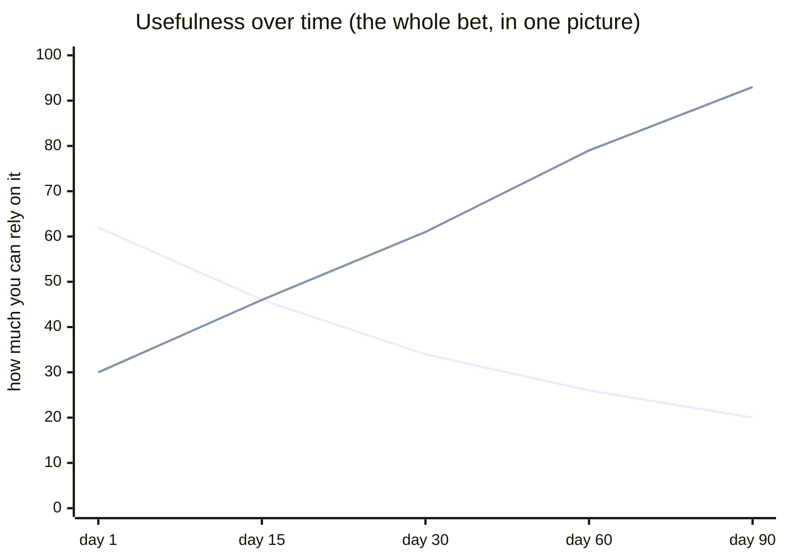

# What this is, in plain words

*(No jargon. If you want the internals, read `README.md` and `DECISIONS.md`.
This page is for explaining trellis to a normal person — or to yourself at the
start.)*

## The one sentence

**Most AI-agent frameworks are built to get tasks done. trellis is built to be
trusted** — so the longer it runs, the more you can rely on it, instead of less.

## The everyday picture

Think about the difference between two assistants.

The first is a **fast intern**. You give it a job, it goes off and does
something, and it tells you it's done. Sometimes it's right. Sometimes it says
"done!" when it isn't. It forgets what happened yesterday. It'll send an email on
your behalf before you've seen it. When it's unsure, it guesses and sounds
confident. Most AI agents today are this intern — and they're getting faster,
which means they can be confidently wrong faster.

The second is a **trustworthy junior colleague who keeps a lab notebook**. They
write down what they decided and *why*. They date everything, so they never
confuse last month's plan with this week's. They have someone *else* check their
work before it counts as done. They'll tell you plainly "I'm not sure — here are
the three people we should ask" instead of bluffing. And they never send anything
out the door without you saying yes. That colleague gets *more* valuable the
longer they work with you, because the notebook fills up.

**trellis is the framework for building the second kind.**

## The five promises (what makes it different)

Other frameworks add these if you're careful. trellis makes them structural — the
code literally won't let the agent break them:

1. **It never quietly fails.** If something breaks or the agent does nothing, it
   *says so* and writes it down. No silent dead-ends.
2. **It never grades its own work.** When the agent says "done," a *different*
   checker (a second, cheaper AI, or a rule) confirms it before you trust it. An
   agent marking its own homework isn't allowed.
3. **It doesn't pretend to be something it isn't.** No fake "soul," no claiming to
   *see* your screen or *feel* things. It describes itself honestly: an agent that
   reads files and makes decisions. (This one sounds philosophical; it's actually
   practical — an agent that lies to itself about what it is will lie to you about
   what it did.)
4. **It always knows what's out of date.** Everything it remembers is stamped with
   *when*, and stale information is flagged as stale. It won't treat a decision from
   April as if it were made today.
5. **It never sends, posts, or changes anything on its own.** Everything it wants
   to do waits for your yes. You're always the last step before the world.

## Why "gets more useful over time" is the whole point

A fast-intern agent demos beautifully on day one and rots by day thirty — it
forgets, its memory gets muddled, it burns money running in circles. trellis is the
opposite: every decision it makes is written down with a receipt (what, when, why,
who, and whether it was checked). That record *piles up*. After a few months, a
brand-new agent — or a new teammate — can read back exactly what was decided and
why, and whether it still holds. The agent itself is disposable; **the notebook is
the thing that lasts.** It's less like a magic robot and more like compound
interest.

Upper line at the start, then falling: the **fast-intern agent** — impressive
demo, rots as it forgets. Lower line at the start, then climbing: **trellis** —
modest on day one, more trustworthy every week as the notebook fills.

## The plain terms people search for

If someone asked "what category is this," these are the honest, commonplace labels:

- an **accountable** AI agent (everything it does is on the record)
- an **auditable** / **traceable** agent (you can always check what happened and why)
- an **independently-verified** agent (a second checker confirms its work — it
  can't self-certify)
- a **human-in-the-loop** / **approval-gated** agent (nothing sends without your yes)
- a **time-aware** agent (it knows what's current vs. stale)
- an agent with **memory that compounds** (more useful the longer it runs)
- an **honest** agent (no pretend body, no pretend feelings, no faking "done")
- a **judgment** agent, not a **task** agent (it forms and records opinions —
  including "no" and "let's get more input" — rather than just executing)

## The one-line contrast

| Ordinary agent frameworks | trellis |
|---|---|
| Optimize for **doing the task** | Optimize for **being trusted** |
| "It's done" (maybe) | "It's done, and here's who checked it" |
| Forgets between sessions | Keeps a dated notebook that compounds |
| Acts, then tells you | Proposes, waits for your yes |
| Sounds confident when unsure | Says "no" or "let's ask three people" |
| More useful on day 1 than day 30 | More useful on day 30 than day 1 |

That's it. Everything technical in this repo exists to make those promises
impossible to break by accident.
