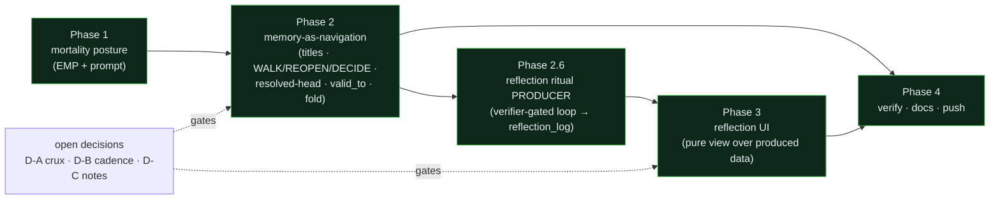

# Integration plan — v0.2: the mortality posture, memory-as-navigation, and the reflection UI

**Date:** 2026-07-17 · **Status:** PLAN — to be stress-tested before any code changes.
**Rule:** this plan gets adversarially attacked (like the harness attacks itself) and
hardened *before* we build. Nothing here is committed to code yet.

This folds the whole session's design work into one buildable sequence, across **both**
the harness and the UI, without breaking a single one of the invariants that make
trellis trellis.

---

## 0. What this incorporates (and where it came from)

| Design decision | Source in the repo |
|---|---|
| The **mortality posture** (you are time-blind / you remember nothing → what do you leave behind) | `docs/exploration/memory-as-navigation.md` §7 R3 |
| **00-grade searchable titles** as the memory index (search titles, open bodies on match) | exploration §7 R1 |
| **WALK / REOPEN / DECIDE** three-verb grammar; "not locked" verdict, immutable record | exploration §3.1, §7 R2 |
| **Resolved-head cache** (navigate cold, cache hot) | exploration §3.2 |
| **Forgetting** = `valid_to` + an active index | exploration §3.4 |
| **Fold-not-clobber** workspace writes | exploration §3.5 (a real bug) |
| **Comprehension-and-reflection UI** (not an ops console) | `docs/ROADMAP-UI-SPINE.md` |
| The **reflection portal** (grounded daily self-image ritual; self-change = verified proposal) | `ROADMAP-UI-SPINE.md`, `docs/lineage/2026-07-15-ui-comprehension-reflection.md` |

## 1. Open decisions this plan ASSUMES (your calls — correct me and the plan flexes)

The build branches on three things that are genuinely yours to ratify. I've assumed a
default for each so the plan is complete; each is flagged where it bites.

- **D-A · The crux `T` → assumed YES.** "Relearn" = **WALK re-inhabits** (read-only);
  divergence **records** a new node (REOPEN/DECIDE), never a silent flip. Everything in
  Phase 2 depends on this. *If you say no, Phase 2b changes shape.*
- **D-B · Reflection cadence → assumed 24h.** A once-daily "who I was yesterday vs
  today" ritual, with an *optional* lightweight midday pulse (off by default). *Changes
  the Reflection page shape in Phase 3.*
- **D-C · Do notes/skills become saplings? → assumed NO (keep the cheap note).**
  Formal **decisions** are the Y/N/T saplings; freeform notes/skills stay freeform —
  **but every persisted memory, of any kind, gets a 00-grade title.** *If yes, Workspace
  and DecisionLog partly merge — bigger, flagged in Phase 2a.*

## 2. Invariants that MUST survive the whole build (the regression contract)

If any phase breaks one of these, the phase is wrong, not the invariant:

1. **All existing tests stay green** (135 today) and every new mechanism ships with tests.
2. **The five refusals hold** — no silent failure, no self-certification, no soul, no
   naked `now()`, no auto-fire.
3. **Determinism-with-receipts** — the record stays append-only and bitemporal; nothing
   the model does becomes non-deterministic *authority*. (WALK re-inhabits; it does not
   silently re-decide.)
4. **The mortality posture stays FUNCTIONAL, never emotional** — `no-soul.md` is the
   line; "this session dies" is a fact and a motivation, never performed dread.
5. **The synthesis test still gates every write** — mortality motivates leaving-behind;
   it does not license bloat.
6. **Core stays zero-dependency**; the web extra stays optional.

## 3. The phases (ordered cheapest-and-most-reframing first)

### Phase 1 — The mortality posture (EMP + standing rules) · *small, high-leverage*

**Why first:** it's a ~1-file change, it costs almost nothing, and it reframes how the
whole rest of the system reads. It's the frame the memory serves.

- `emp.py`: extend `HONEST_IDENTITY` and add a **standing posture** block: *"You are
  time-blind — understand it; here are the tools so you don't have to be. You remember
  nothing — ground everything in what you choose to leave behind; here is where you
  look."* Plus the session-mortality line: *this session will not be remembered by you;
  what will you leave?*
- `prompt.py`: the standing rules already carry the clock legend + navigate-don't-assume;
  add the mortality posture to the always-resident O(1) set (~+120 tokens; keep under the
  1,200 budget — verify).
- **Guardrail lint** (extends the embodiment linter): flag *emotional* mortality
  ("I fear", "I dread", "I don't want to die") while allowing *functional* mortality
  ("this session ends; the record survives").
- **Tests:** standing prompt carries the posture; budget not exceeded; the dread-lint
  catches emotional framing and passes functional framing.

### Phase 2 — Memory as navigation (harness core) · *the substantive one*

Built as five small, independently-testable moves, each with its own adversarial check.

- **2a · 00-grade titles + search-by-title.** Every `memory_write` and `decision` carries
  a required, keyword-findable **title** (reject vague/empty titles — a lint like the
  synthesis test). Add `search_titles(keywords)` → returns matching titles only; bodies
  open on demand. *(If D-C = yes, this is where notes/decisions converge.)*
- **2b · The three-verb grammar** (`decisions.py` / a new `navigate.py`) — **specified to
  compose with the EXISTING `Decision` constraints** (the stress-test proved the naive
  sketch could not; flaws #1, #2):
  - `walk(node)` → read-only reconstruction of the *why*; cannot return a new verdict
    (type-level). Unchanged.
  - `reopen(node, trigger)` → does **NOT** mint a `Decision(verdict=T)`. A real `T`
    requires ≥3 POVs + owner + revisit + missing (`IncompleteTriangulationError`
    otherwise); a trigger supplies 0–1 POVs, so a bare T is *illegal to construct*.
    Instead `reopen` writes a lightweight **reopen-marker** that re-surfaces the node
    through the existing `hidden_nos` path ("this needs re-triangulation"). Only a
    subsequent step that assembles the full T payload promotes it to a real `T`.
  - `decide(node)` → emits Y/N **only** on (a) a brand-new question-key with no live
    decision, or (b) resolving an existing `T` via `resolve()` (which supersedes and is
    anti-fork-protected). It **refuses** to mint a Y/N whose question-key (normalized
    subject / the 2a 00-grade title) collides with any *active* decision — that must go
    through `reopen` first. **This is what actually enforces "divergence records, never a
    silent flip"** (the naive plan left `decide`'s "new node" path wide open).
  - **Anti-fork extended:** the ledger/`DecisionLog` guard must detect two live heads
    sharing a *question-key*, not only two entries sharing a `supersedes` link (today's
    guard is nested inside `if supersedes is not None`, so an unlinked fork slips
    through — that's the silent re-decide route).
- **2c · Resolved-head cache.** A materialized view = the **validity-aware** HEAD of each
  decision's supersession chain (routed through `active()`, **not** raw `current()`),
  cached for hot reads; navigation is the path for cold/stale/audit. Pure function over
  the ledger; no new store.
- **2d · Forgetting = ONE current-truth resolver** (flaw #4: the plan had two). `active()`
  = not-superseded **AND** in-validity becomes the single resolver; `current()`, the 2c
  cache, and `search_titles` / `Ledger.search` (which reads `current()` today) are **all**
  routed through validity, so no read path serves a retired-but-unsuperseded sapling.
  `valid_to` closure is an **appended retirement record** (append-only — never an `Entry`
  mutation). The title-index / memory map indexes active only.
- **2e · Fold-not-clobber.** `Workspace.write` versions on overwrite (retain the
  superseded body in the ledger or a `.history`); the bug from exploration §3.5.
- **Tests + a small adversarial round** after 2 lands. The round MUST include (from the
  plan stress-test): *can two live decisions answer the same question-key with no
  supersession link?* · *does WALK ever emit a verdict?* · *does the resolved-head cache
  or `search` serve a validity-retired sapling?* · *can a title be un-findable?* · *does
  fold lose content?*

### Phase 2.6 — The reflection ritual (the producer Phase 3 needs) · *found missing*

The stress-test caught (flaw #3) that the Reflection page has **no data producer** —
`reflection_log`, self-change proposals, and the self-image series are data *nobody
writes yet*, so Phase 3 could not honestly be "view over existing data." This phase
builds the producer, and it is **verifier-gated**:

- A `reflection` **`LoopSpec` + `Schedule`** (cadence per **D-B**) that runs the private
  daily pass over the day's ledger slice.
- Writes an append-only **`reflection_log`** entry that **cites clickable real events**,
  through the **synthesis gate** (leave only what can't be re-derived) and the
  **dread-lint** (functional, not emotional).
- Stages any self-change as a **verified proposal** actually wired to the verifier panel
  (not asserted) — it cannot take effect unverified.
- The self-image series is derived from the existing `growth_stats` at each ritual run
  and stored in the `reflection_log`, so "yesterday vs today" is real history, not a mock.
- **Tests:** the ritual writes a `reflection_log`; the dread-lint holds; a self-change
  cannot take effect unverified.

### Phase 3 — The reflection UI (comprehension-and-reflection portal) · *the rebuild*

**Depends on Phase 1, 2, AND 2.6** — now genuinely *pure view over produced data* (not a
mock).

- Replace the single-page dashboard with a **side nav of dedicated, self-explaining
  pages** (`ROADMAP-UI-SPINE.md` §pages): Overview / Activity (copy-pasteable debug log)
  / Agents / Decisions (that *open up* — a WALK view of the lineage) / Loops (dive-in) /
  Verification (verifiers *in the act*) / **Reflection**.
- **Reflection page** = the daily ritual: today's self-image beside yesterday's; the
  grounded, **cited** "why I look like this"; the day's deltas; and a self-change shown
  as a **verified proposal**. Cadence per **D-B**.
- **Approvals**: the UI shows the *record* of what was staged/approved/denied (the yes
  happens in Discord); the inbox stops being the centrepiece.
- Terms self-define; no insider vocabulary.
- Reuse: the ledger-as-event-store, pure view functions, the honest-glyph discipline.
- **Tests:** pure view/glyph functions stay tested; a fresh screenshot per page.

### Phase 4 — Verify, document, push · *the close*

- Full `pytest` green; `stress_test.py` 10/10; **one adversarial workflow round** on the
  new harness code (the 4-round pattern, scaled to what changed).
- Update every doc + diagram that references the old memory model or the old UI (README,
  VISUAL-TOUR, DECISIONS.md gets new entries D13–D18, ACCEPTANCE.md gets the new
  guarantees, VERIFICATION.md gets the round).
- Regenerate demo + screenshots; commit in logical history; deliver zip + push commands.

## 4. Sequencing & dependencies (one picture)

## 5. What we deliberately do NOT do (scope discipline)

- **No auto-consolidation "dream" subagents** (Letta's pattern) — they write memory
  without the verification gate; that's the cardinal sin. (Exploration §6, standing N.)
- **No collapsing Workspace + DecisionLog into one store** unless D-C flips — keep the
  cheap freeform note.
- **No boiling the ocean in one commit** — four phases, each green before the next.
- **No new runtime dependency** in the core.
- **No re-litigating the settled** — the five refusals, the ledger, the verifier panel
  stay; this extends them, it does not rewrite them.

## 6. Rough size & risk (honest)

- Phase 1: ~half a day, low risk. Phase 2: the real work, ~2–3 focused passes, medium
  risk (the three-verb grammar is the delicate part). Phase 3: ~2 passes, low-medium
  risk (mostly view code over existing data). Phase 4: continuous.
- Biggest risk: **Phase 2b non-determinism leak** — if WALK can ever emit a verdict, we
  break invariant #3. Mitigated by type-level enforcement + an adversarial check.
- Second risk: **scope** — "incorporate everything" tempts a rewrite. The plan resists
  by phasing and by the do-not-do list.

---

## 7. Hardening log — the plan stress-test (2026-07-17)

8 adversarial agents attacked this plan; each finding was independently re-verified.
**4 confirmed flaws (3 high, 1 medium)**, all grounded in the actual code — fixed above
*before any build*. This is the harness's own doctrine (adversarial verification)
applied to its own plan.

| # | Sev | Flaw the plan had | Fix folded in |
|---|-----|-------------------|---------------|
| 1 | HIGH | `decide`'s "new node" path left the crux **unenforced** — an agent could mint a fresh Y/N `Decision(supersedes=None)` on a settled question; `current()` returns both as live heads (the anti-fork guard only fires when `supersedes is not None`). The exact silent re-decide D-A forbids. | §2b: `decide` refuses a Y/N whose **question-key collides** with a live decision → must route through `reopen`; anti-fork guard extended to detect two live heads sharing a question-key. |
| 2 | HIGH | `reopen` "writes a T" is **impossible** — a real `T` needs ≥3 POVs + owner + revisit + missing; a trigger supplies 0–1, so `Decision(verdict=T)` raises `IncompleteTriangulationError`. The centrepiece anti-drift path couldn't execute. | §2b: `reopen` writes a lightweight **reopen-marker** (re-surfaces via `hidden_nos`), never a bare T; a later step assembles the full T payload to promote. |
| 3 | HIGH | The Reflection page (the UI "heart") had **no producer** — no `reflection_log`, no self-change proposal, no self-image series is written by anything. Phase 3 couldn't be "view over existing data." | **New Phase 2.6** — a verifier-gated reflection loop that writes the `reflection_log` (cited, synthesis-gated, dread-linted) and stages self-change as a verified proposal. Phase 3 re-scoped to pure view. |
| 4 | MED | **Two rival current-truth predicates** — `current()` (supersession only) vs `active()` (supersession + validity). A validity-retired-but-unsuperseded sapling leaks through `current()`/the cache/`search`. | §2c/2d: `active()` becomes the **single** resolver; `current()`, the cache, and `search` all validity-aware; `valid_to` as an appended retirement record. |

**What held up (the 4 angles that found no real flaw):** invariant-preservation beyond
the two above, mortality-vs-no-soul (the dread-lint framing survived scrutiny — kept as a
heuristic backstop, honestly labelled), scope/cost (the phasing + do-not-do list held),
and sequencing (Phase 1→2→2.6→3→4 is sound once 2.6 exists).

---

*Plan status: **hardened (v0.3)**. Next step: on your go, and once **D-A / D-B / D-C** are
confirmed, build Phase 1 → 4 and push — each phase green before the next, with the
Phase-2 adversarial round as specified.*
