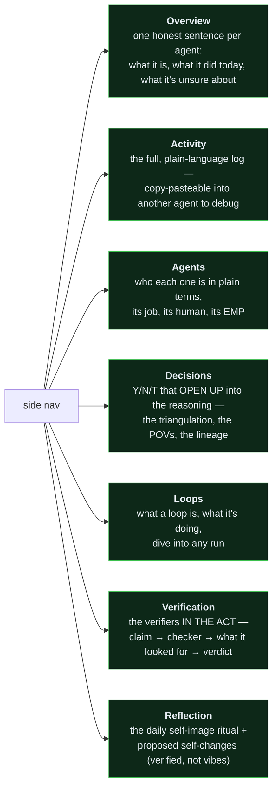
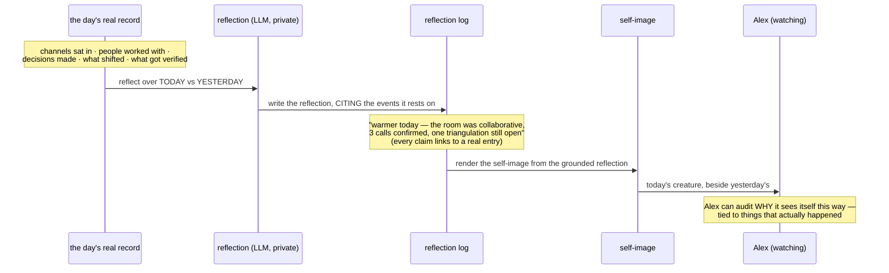

# Roadmap — the UI spine: a comprehension-and-reflection portal

> Status: **vision doc, being rebuilt on a reframe.** v1 of the UI shipped as an
> operations dashboard and was wrong in an instructive way — see the cognitive
> lineage of the correction:
> [`lineage/2026-07-15-ui-comprehension-reflection.md`](lineage/2026-07-15-ui-comprehension-reflection.md).
> This document is the corrected vision. The code rebuild follows it.

---

## The correction that reframes everything

v1 built a place to **operate** the agent — an approvals inbox, a health board, a
trust percentage, everything on one page in insider vocabulary. That was the
market's generic control-plane dashboard, and it's the exact genre the founding
brief warned against ("people don't know what it means"). The reframe:

> **The UI is not an operations console. It is a comprehension-and-reflection
> portal** — a place to *understand* the agent, and the room where the agent
> *understands and re-images itself* each day.

The work lives in Discord and email. You do not do work in this UI. Its two jobs:

1. **Make the invisible legible** — the verifier agents, the loops, the
   multi-agent coordination that you never see in Discord — in terms a
   non-engineer understands, so they come to understand their agent the way an
   engineer would. That is the **00-grade** bar: *an agent or a human can
   understand what is being said.*
2. **Be a reflection portal** — orient the agent to reflect on itself daily,
   see where it was versus how it changed, and choose (with a checker) how it
   wants to change tomorrow. "Remember with power each day."

---

## Five principles

**1 · Everything self-explains (the zero-grade test).** No term appears on the
surface without defining itself. "A witness" is out; "the agent watching #chiefs
and forming opinions" is in. If a non-engineer can't read a panel and know what it
means, the panel is wrong, not the reader.

**2 · The work lives elsewhere.** Discord is Discord; email is email. This surface
does not send, post, or do work. The staging guarantee (an agent never auto-fires)
stays real in the *backend*, but the human's *yes* happens where the human already
is — in Discord — and the UI shows the *record* of what was proposed and decided,
as story. No inbox-as-switchboard.

**3 · Make the invisible visible.** The whole value is showing what Discord hides:
verifiers checking a claim, loops running and blocking, multiple agents
coordinating. Not as traces and spans (that's the engineer's drill-down), but as a
legible account of *what is happening and why*.

**4 · Navigable, dedicated pages — never one crammed page.** A side nav; each
section a single job; each with a shallow "what is this" layer over a deep
drill-down. You always know where you are.

**5 · A reflection portal at the centre, honest by construction.** The agent's
daily self-image is a real reflective *process*, not a widget — and every
depiction traces to cited real events. Richer than a fixed formula; never a soul.

---

## The pages (each its own room)

**Overview** — the front door. One plain sentence per agent: *"Atlas watched
#chiefs and 3 transcripts today, formed 4 opinions, is waiting on one triangulation
about the pricing canon."* No jargon, no metrics-for-their-own-sake.

**Activity** — a complete, human-readable log of everything the agent did, newest
first, in plain language. Designed for one specific use the v1 missed: when
something breaks, you copy the log straight out and paste it into another agent —
*"here's what mine did, help me figure out what's wrong with the one in Discord."*
The log is the debugging handoff.

**Agents** — answers "what *is* this thing." Each agent in plain terms: its job,
whose it is, what it's allowed to touch, its EMP (ends/means/principles). This is
also where **multiple agents** and their relationships become visible — the
coordination you never see in Discord.

**Decisions** — the Y/N/T record, but each decision *opens up*. Not "T · memory
fork" in a list, but: the question, the three named points of view, what's still
missing, who owns resolving it, when it's due, and the breadcrumbs back to the EMP
that generated it. This is triangulation made legible — *how* the agent reasoned,
which is the entire point.

**Loops** — answers "what is a loop, and what is this one doing." A loop explained
in plain terms, its cadence, its current state, and a dive-in to any single run:
what it sensed, what it decided, whether it was verified.

**Verification** — the invisible layer, surfaced. Not a trust percentage; the
**verifiers caught in the act**: here is a claim the agent made, here is the
independent checker (a different, cheaper agent), here is what it looked for
(correctness / freshness / attribution / reproducibility), here is why it passed or
was refused. This is what bridges a non-engineer to understanding — you *see* the
"a second set of eyes" promise happening.

**Reflection** — the heart. See below.

---

## The Reflection portal (the self-image, done right)

Alex's reframe: the self-image is **for the agent to understand itself in another
way.** It is private — never injected into the prompt it uses to talk to people.
It is a **daily ritual**: the agent reflects on the day's real record and its
surroundings, sees *where it was versus how it changed* over the cycle, and renders
that understanding as an image of itself.

Two guardrails keep it honest (the line that does not move):

- **Grounded + logged + cited.** The reflection is richer than a fixed formula —
  it can be moved by "surroundings," by the texture of the day — but every
  depiction must cite the real events it rests on, and those citations are
  clickable. You can always ask "why do you look like that today?" and get a true
  answer. This is the anti-soul: a self-concept re-derived daily from the record,
  not a fiction that never updates (`no-soul.md`).
- **Self-change is a verified proposal, not a vibe.** When the reflection produces
  a *want to change how it works* tomorrow — "remember with power," orient
  differently — that is a **proposal that goes through a checker**, like any other
  claim. The reflection portal is wired into the same verification discipline as
  everything else; it doesn't get to quietly rewrite the agent.

**Open question (Alex's call):** the cadence. A full **24h** ritual ("who I was
yesterday vs today"), or a shorter **8–12h** working-day pulse? This changes the
shape of the whole portal — whether it's a once-a-day mirror or a twice-a-day one.
Left open here on purpose.

What the portal shows: today's self-image beside recent ones (the transformation
over time Alex wanted to watch); the reflection text with its citations; the
day's deltas that moved it; and any pending self-change proposals awaiting a
verifier.

---

## What survives from v1 (the parts that were right)

- **The ledger is the event store.** Every page reads from it; no database, no
  broker. This was correct and stays.
- **Pure view functions** (`web/views.py`) and a **deterministic honest renderer**
  (`web/glyph.py`) — the honest-by-construction discipline is the foundation the
  richer reflection builds on, not a thing to discard.
- **FastAPI + HTMX + SSE**, buildable by one person.
- The **two-tier idea** (comprehend on top, verify underneath) — but applied
  *per page* as shallow-over-deep, not as one page over a trace viewer.

## What changes

- Kill the single crammed page → a side nav of dedicated rooms.
- Kill the approvals-inbox centrepiece → approvals live in Discord; the UI shows
  the record.
- Kill insider vocabulary → every term self-defines.
- Turn "trust: 83%" → the verifiers in the act.
- Turn the deterministic glyph widget → a grounded, logged, cited daily reflection
  ritual, with the honest-glyph discipline underneath it.
- Add: multi-agent visibility, loop dive-in, decision reasoning that opens up, the
  copy-pasteable debugging log.

---

## Plain-language backend loops (unchanged, still the differentiator)

Setting up an agent routine in prose — *"at end of day, harvest what you learned
into a skill"* — still compiles to a `LoopSpec` + `Schedule` + verifier, with a
dry-run preview, the prose as source of truth. This lives naturally on the **Loops**
page now: you *write* a loop in plain language and *watch* it there. And the
end-of-day-harvest loop is the same ritual as the Reflection portal's — the agent
reflecting, learning, and proposing changes, all gated by verification.

---

*Built on the cognitive lineage in
[`lineage/2026-07-15-ui-comprehension-reflection.md`](lineage/2026-07-15-ui-comprehension-reflection.md).
The code rebuild follows this doc — not before we're aligned on it.*
