# trellis — the visual tour

Everything in this repo, as pictures. If the README is the pitch and `DECISIONS.md`
is the argument, this is the map. Diagrams render natively on GitHub (Mermaid);
the glyphs and the UI shot are committed images.

---

## 0. The whole thing at a glance

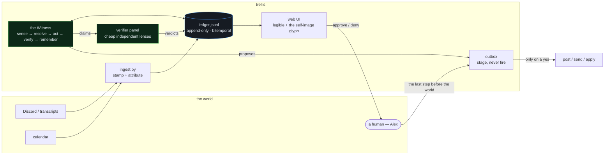
```mermaid
flowchart LR
    subgraph world["the world"]
        DISCORD["Discord / transcripts"]
        CAL["calendar"]
        HUMAN(["a human — Alex"])
    end

    subgraph trellis["trellis"]
        direction TB
        INGEST["ingest.py<br/>stamp + attribute"]
        LEDGER[("ledger.jsonl<br/>append-only · bitemporal")]
        WITNESS["the Witness<br/>sense → resolve → act → verify → remember"]
        PANEL["verifier panel<br/>cheap independent lenses"]
        OUTBOX["outbox<br/>stage, never fire"]
        UI["web UI<br/>legible + the self-image glyph"]
    end

    DISCORD --> INGEST
    CAL --> INGEST
    INGEST --> LEDGER
    WITNESS <--> LEDGER
    WITNESS -- "claims" --> PANEL
    PANEL -- "verdicts" --> LEDGER
    WITNESS -- "proposes" --> OUTBOX
    LEDGER --> UI
    UI -- "approve / deny" --> HUMAN
    HUMAN -- "the last step before the world" --> OUTBOX
    OUTBOX -- "only on a yes" --> ACTION["post / send / apply"]

    classDef store fill:#161b22,stroke:#58a6ff,color:#e6edf3
    classDef act fill:#0d2818,stroke:#3fb950,color:#e6edf3
    class LEDGER store
    class WITNESS,PANEL act
```

The agent is disposable. **The ledger is the thing that lasts** — every other box
reads from or writes to it.

---

## 1. The working loop (what the agent actually does)

Not "do a task." The unit of work is a *recorded, checked judgment*.

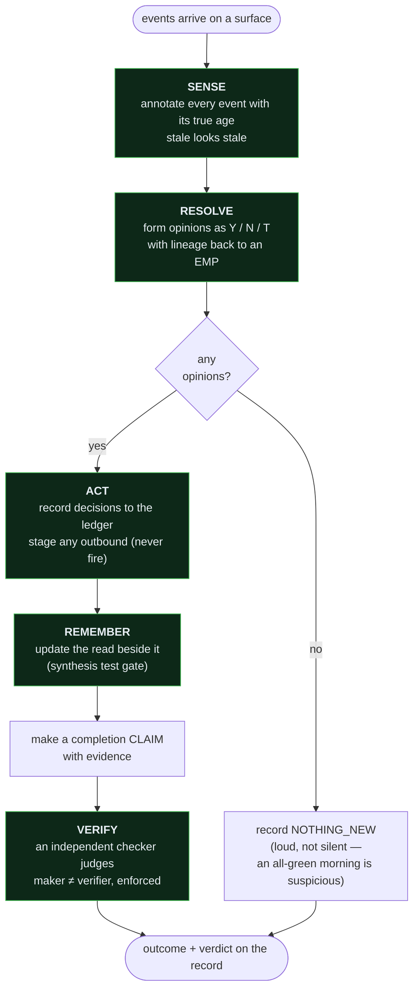
```mermaid
flowchart TD
    START([events arrive on a surface]) --> SENSE
    SENSE["<b>SENSE</b><br/>annotate every event with its true age<br/>stale looks stale"] --> RESOLVE
    RESOLVE["<b>RESOLVE</b><br/>form opinions as Y / N / T<br/>with lineage back to an EMP"] --> EMPTY{"any<br/>opinions?"}
    EMPTY -- "no" --> NOTHING["record NOTHING_NEW<br/>(loud, not silent —<br/>an all-green morning is suspicious)"]
    EMPTY -- "yes" --> ACT
    ACT["<b>ACT</b><br/>record decisions to the ledger<br/>stage any outbound (never fire)"] --> REMEMBER
    REMEMBER["<b>REMEMBER</b><br/>update the read beside it<br/>(synthesis test gate)"] --> CLAIM
    CLAIM["make a completion CLAIM<br/>with evidence"] --> VERIFY
    VERIFY["<b>VERIFY</b><br/>an independent checker judges<br/>maker ≠ verifier, enforced"] --> DONE([outcome + verdict on the record])
    NOTHING --> DONE

    classDef step fill:#0d2818,stroke:#3fb950,color:#e6edf3
    class SENSE,RESOLVE,ACT,REMEMBER,VERIFY step
```

Its stopping condition is *"my read is current and my opinions are on the record"* —
never *"the task list is empty."*

---

## 2. The five refusals (structural, not advisory)

The code raises; it doesn't remind.

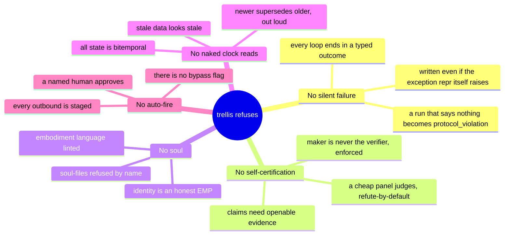
```mermaid
mindmap
  root((trellis refuses))
    No silent failure
      every loop ends in a typed outcome
      a run that says nothing becomes protocol_violation
      written even if the exception repr itself raises
    No self-certification
      maker is never the verifier, enforced
      claims need openable evidence
      a cheap panel judges, refute-by-default
    No soul
      identity is an honest EMP
      soul-files refused by name
      embodiment language linted
    No naked clock reads
      all state is bitemporal
      stale data looks stale
      newer supersedes older, out loud
    No auto-fire
      every outbound is staged
      a named human approves
      there is no bypass flag
```

---

## 3. The atomic record: a Y / N / T decision

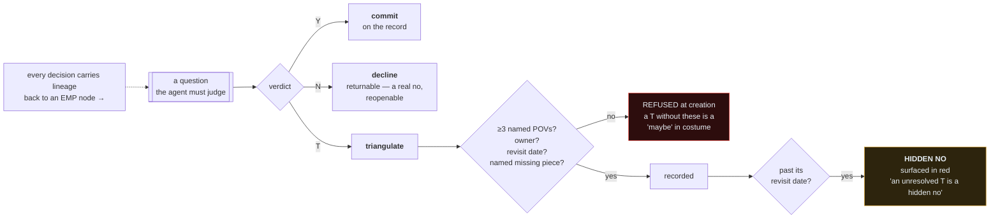
```mermaid
flowchart LR
    Q[["a question<br/>the agent must judge"]] --> V{verdict}
    V -->|Y| Y["<b>commit</b><br/>on the record"]
    V -->|N| N["<b>decline</b><br/>returnable — a real no,<br/>reopenable"]
    V -->|T| T["<b>triangulate</b>"]
    T --> G{"≥3 named POVs?<br/>owner?<br/>revisit date?<br/>named missing piece?"}
    G -->|no| REJ["REFUSED at creation<br/>a T without these is a<br/>'maybe' in costume"]
    G -->|yes| OK["recorded"]
    OK --> AGE{"past its<br/>revisit date?"}
    AGE -->|yes| HN["<b>HIDDEN NO</b><br/>surfaced in red<br/>'an unresolved T is a hidden no'"]

    ALL["every decision carries lineage<br/>back to an EMP node →"] -.-> Q
    classDef bad fill:#2d0d0d,stroke:#f85149,color:#e6edf3
    classDef warn fill:#2d240d,stroke:#d29922,color:#e6edf3
    class REJ bad
    class HN warn
```

---

## 4. The bitemporal ledger (why it can't gaslight you)

Two clocks on every entry, and corrections *append* — nothing is ever rewritten.

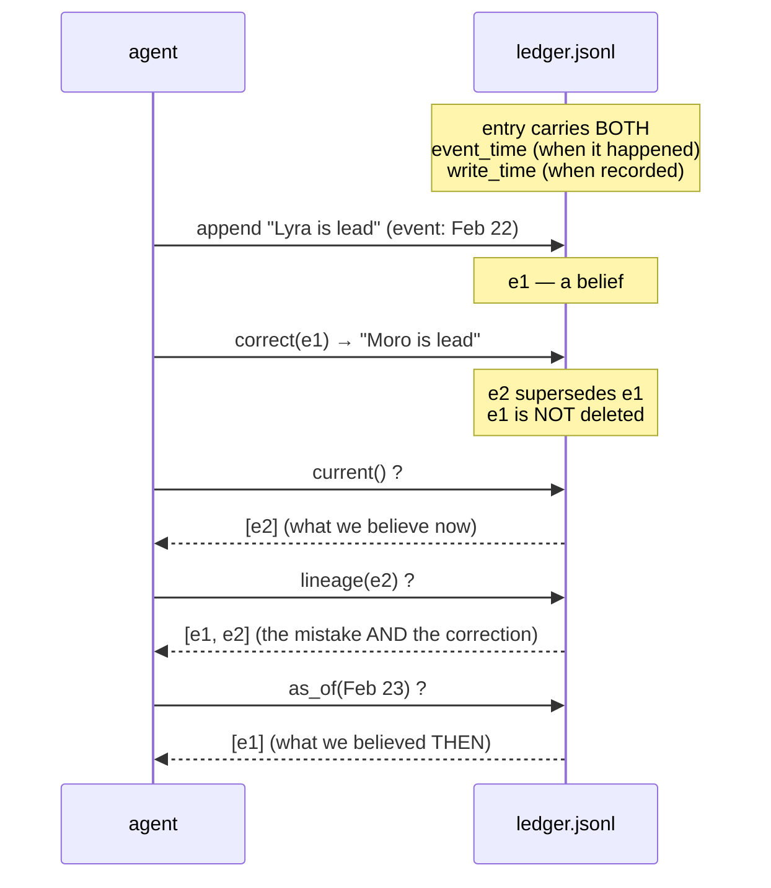
```mermaid
sequenceDiagram
    participant A as agent
    participant L as ledger.jsonl
    Note over L: entry carries BOTH<br/>event_time (when it happened)<br/>write_time (when recorded)
    A->>L: append "Lyra is lead" (event: Feb 22)
    Note over L: e1 — a belief
    A->>L: correct(e1) → "Moro is lead"
    Note over L: e2 supersedes e1<br/>e1 is NOT deleted
    A->>L: current() ?
    L-->>A: [e2]  (what we believe now)
    A->>L: lineage(e2) ?
    L-->>A: [e1, e2]  (the mistake AND the correction)
    A->>L: as_of(Feb 23) ?
    L-->>A: [e1]  (what we believed THEN)
```

A corrected memory keeps its history; a gaslit one erases it. trellis keeps it.

---

## 5. Verification: the haiku panel (very fragile triangles, very strong)

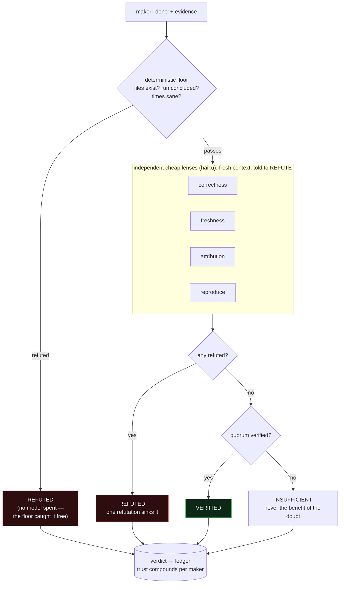
```mermaid
flowchart TD
    M["maker: 'done' + evidence"] --> FLOOR
    FLOOR{"deterministic floor<br/>files exist? run concluded?<br/>times sane?"}
    FLOOR -->|refuted| OUT1["REFUTED<br/>(no model spent —<br/>the floor caught it free)"]
    FLOOR -->|passes| LENSES
    subgraph LENSES["independent cheap lenses (haiku), fresh context, told to REFUTE"]
        direction LR
        L1["correctness"]
        L2["freshness"]
        L3["attribution"]
        L4["reproduce"]
    end
    LENSES --> QUORUM{"any refuted?"}
    QUORUM -->|yes| OUT2["REFUTED<br/>one refutation sinks it"]
    QUORUM -->|no| Q2{"quorum verified?"}
    Q2 -->|yes| OUT3["VERIFIED"]
    Q2 -->|no| OUT4["INSUFFICIENT<br/>never the benefit of the doubt"]

    OUT1 & OUT2 & OUT3 & OUT4 --> LEDGER[("verdict → ledger<br/>trust compounds per maker")]

    classDef good fill:#0d2818,stroke:#3fb950,color:#e6edf3
    classDef bad fill:#2d0d0d,stroke:#f85149,color:#e6edf3
    class OUT3 good
    class OUT1,OUT2 bad
```

The maker is Sonnet-class; the panel is Haiku-class. Verification is where cheap
models earn their keep — good at checking even where they're bad at doing.

---

## 6. Stage, don't fire (the one gate to the world)

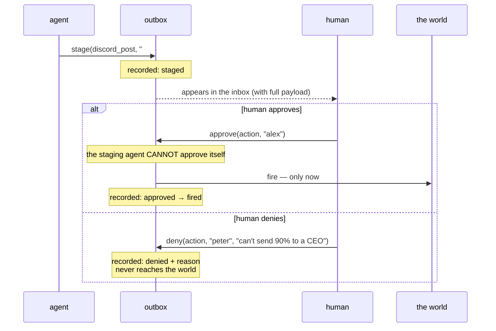
```mermaid
sequenceDiagram
    participant AG as agent
    participant OB as outbox
    participant H as human
    participant W as the world
    AG->>OB: stage(discord_post, "#chiefs", draft)
    Note over OB: recorded: staged
    OB-->>H: appears in the inbox (with full payload)
    alt human approves
        H->>OB: approve(action, "alex")
        Note over OB: the staging agent CANNOT approve itself
        OB->>W: fire — only now
        Note over OB: recorded: approved → fired
    else human denies
        H->>OB: deny(action, "peter", "can't send 90% to a CEO")
        Note over OB: recorded: denied + reason<br/>never reaches the world
    end
```

There is no bypass flag. To auto-fire you'd have to fork the file, and the diff
would say what you did.

---

## 7. Loops that can't spin forever

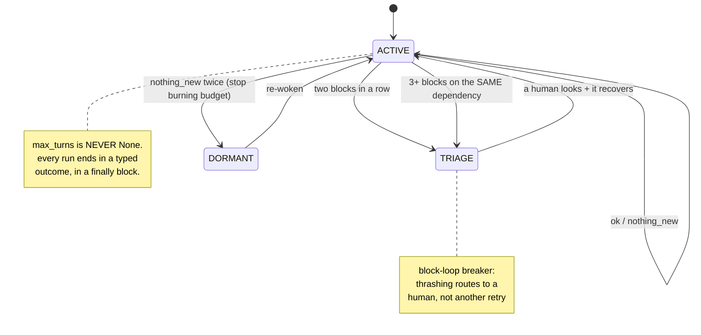
```mermaid
stateDiagram-v2
    [*] --> ACTIVE
    ACTIVE --> ACTIVE: ok / nothing_new
    ACTIVE --> TRIAGE: two blocks in a row
    ACTIVE --> TRIAGE: 3+ blocks on the SAME dependency
    ACTIVE --> DORMANT: nothing_new twice (stop burning budget)
    TRIAGE --> ACTIVE: a human looks + it recovers
    DORMANT --> ACTIVE: re-woken
    note right of TRIAGE
      block-loop breaker:
      thrashing routes to a
      human, not another retry
    end note
    note right of ACTIVE
      max_turns is NEVER None.
      every run ends in a typed
      outcome, in a finally block.
    end note
```

---

## 8. Passes: agents coordinate through files, not vibes

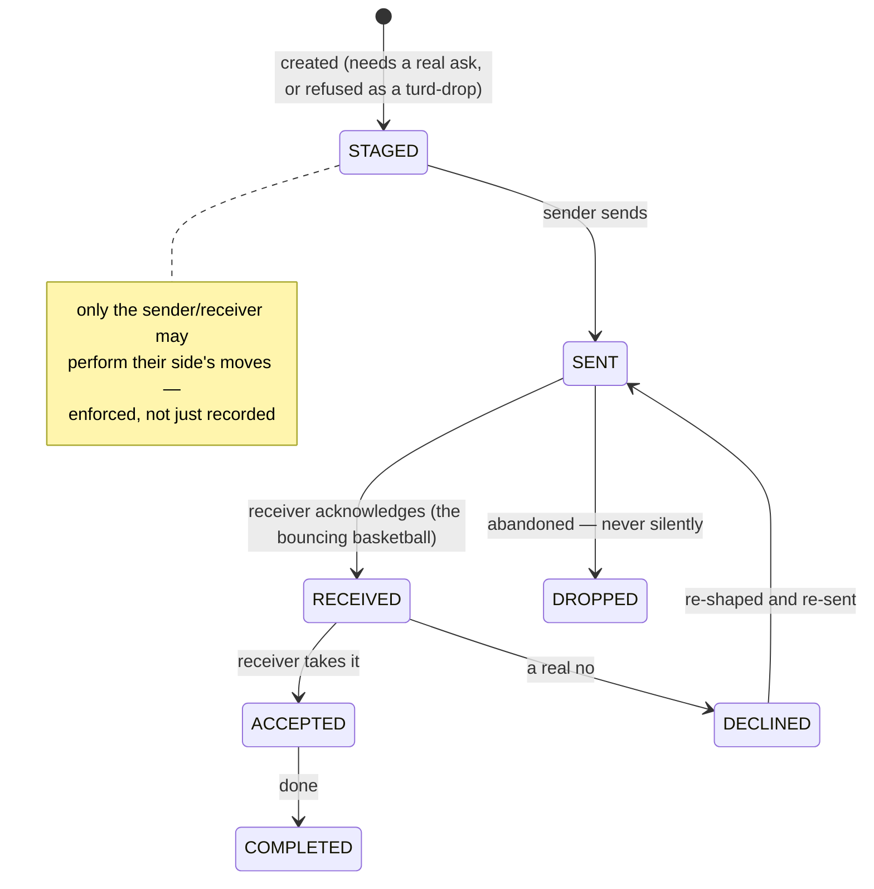
```mermaid
stateDiagram-v2
    [*] --> STAGED: created (needs a real ask, or refused as a turd-drop)
    STAGED --> SENT: sender sends
    SENT --> RECEIVED: receiver acknowledges (the bouncing basketball)
    RECEIVED --> ACCEPTED: receiver takes it
    RECEIVED --> DECLINED: a real no
    DECLINED --> SENT: re-shaped and re-sent
    ACCEPTED --> COMPLETED: done
    SENT --> DROPPED: abandoned — never silently
    note right of STAGED
      only the sender/receiver may
      perform their side's moves —
      enforced, not just recorded
    end note
```

---

## 9. Coordination map (who reads and writes what)

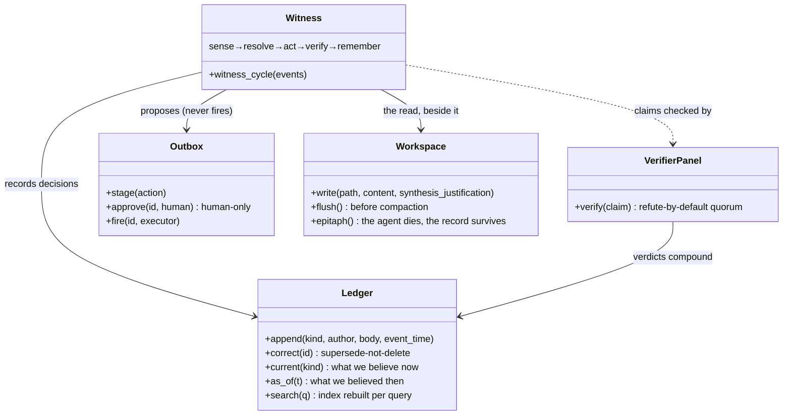
```mermaid
classDiagram
    class Ledger {
        +append(kind, author, body, event_time)
        +correct(id) supersede-not-delete
        +current(kind) what we believe now
        +as_of(t) what we believed then
        +search(q) index rebuilt per query
    }
    class Witness {
        +witness_cycle(events)
        sense→resolve→act→verify→remember
    }
    class VerifierPanel {
        +verify(claim) refute-by-default quorum
    }
    class Outbox {
        +stage(action)
        +approve(id, human) human-only
        +fire(id, executor)
    }
    class Workspace {
        +write(path, content, synthesis_justification)
        +flush() before compaction
        +epitaph() the agent dies, the record survives
    }
    Witness --> Ledger : records decisions
    Witness --> Outbox : proposes (never fires)
    Witness --> Workspace : the read, beside it
    VerifierPanel --> Ledger : verdicts compound
    Witness ..> VerifierPanel : claims checked by
```

---

## 10. Adversarial hardening — the count converging

Four rounds of the harness's own doctrine (adversarial external verification)
run *against the harness*. Each round re-attacked the previous round's fixes.

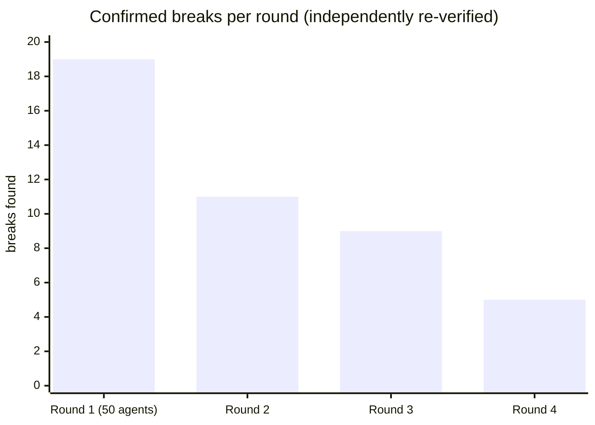
```mermaid
xychart-beta
    title "Confirmed breaks per round (independently re-verified)"
    x-axis ["Round 1 (50 agents)", "Round 2", "Round 3", "Round 4"]
    y-axis "breaks found" 0 --> 20
    bar [19, 11, 9, 5]
```

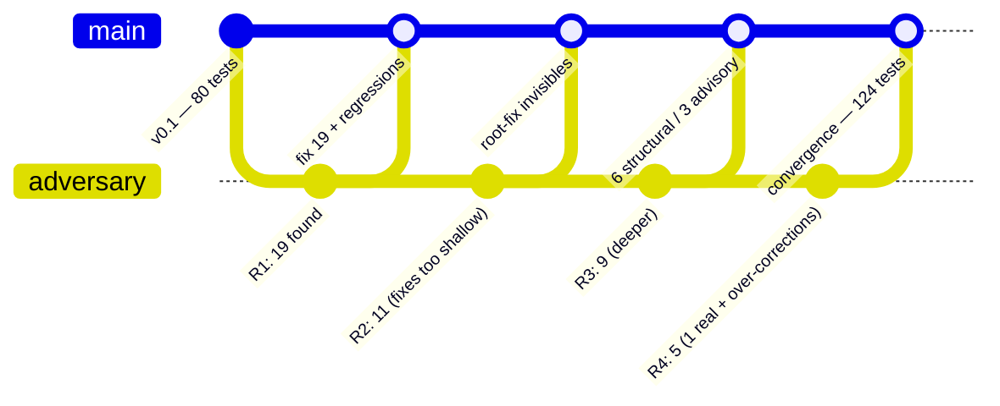
```mermaid
gitGraph
    commit id: "v0.1 — 80 tests"
    branch adversary
    checkout adversary
    commit id: "R1: 19 found"
    checkout main
    merge adversary id: "fix 19 + regressions"
    checkout adversary
    commit id: "R2: 11 (fixes too shallow)"
    checkout main
    merge adversary id: "root-fix invisibles"
    checkout adversary
    commit id: "R3: 9 (deeper)"
    checkout main
    merge adversary id: "6 structural / 3 advisory"
    checkout adversary
    commit id: "R4: 5 (1 real + over-corrections)"
    checkout main
    merge adversary id: "convergence — 124 tests"
```

The point isn't a harness that was never broken. It's one broken **cheaply, in
the open, and closed at the root** each round — and the honest call that the
structural refusals converge while the advisory heuristics can't, and shouldn't
be chased forever.

---

## 11. Two-tier legibility (the UI principle)

The market solved *transparency for engineers* (traces). It didn't solve
*comprehension for a person*.

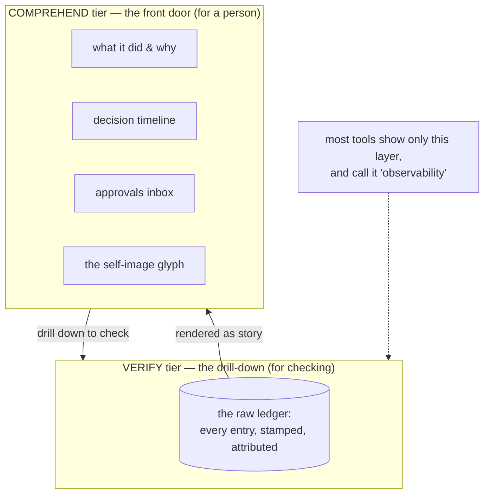
```mermaid
flowchart TB
    subgraph COMPREHEND["COMPREHEND tier — the front door (for a person)"]
        direction LR
        STORY["what it did & why"]
        DEC["decision timeline"]
        INBOX2["approvals inbox"]
        GLYPH["the self-image glyph"]
    end
    subgraph VERIFY["VERIFY tier — the drill-down (for checking)"]
        RAW[("the raw ledger:<br/>every entry, stamped, attributed")]
    end
    COMPREHEND -->|"drill down to check"| VERIFY
    RAW -->|"rendered as story"| COMPREHEND
    note["most tools show only this layer,<br/>and call it 'observability'"] -.-> VERIFY
```

---

## 12. The self-image glyph — an honest data-viz that wears a face

Alex's idea: *the agent draws itself, and the drawing changes as it learns.*
Reconciled with the no-soul principle: **every visual property is a deterministic
function of a real ledger number.** The creature isn't a claimed self — it's the
EMP made visible. It changes only because the record changed.

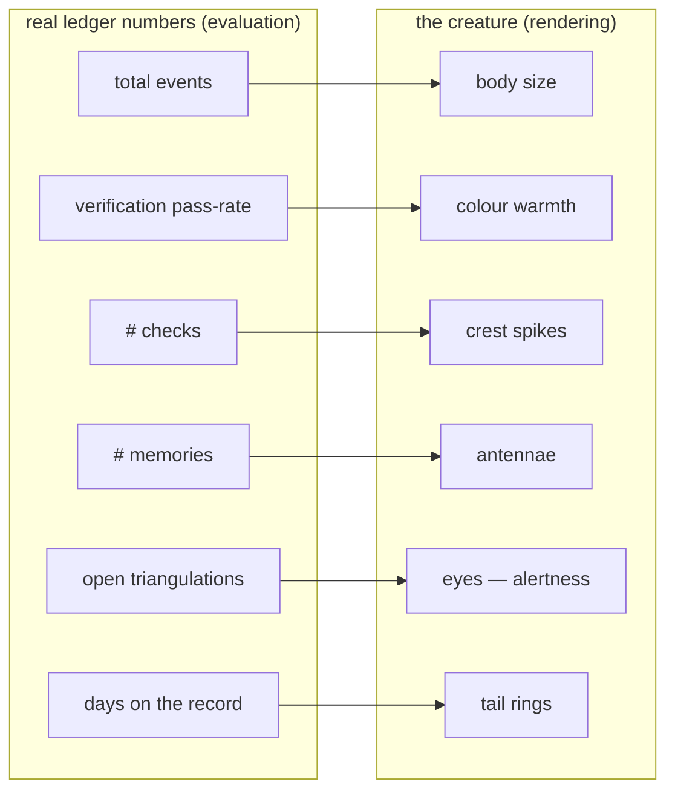
```mermaid
flowchart LR
    subgraph STATS["real ledger numbers (evaluation)"]
        A["total events"]
        B["verification pass-rate"]
        C["# checks"]
        D["# memories"]
        E["open triangulations"]
        F["days on the record"]
    end
    subgraph GLYPH["the creature (rendering)"]
        A2["body size"]
        B2["colour warmth"]
        C2["crest spikes"]
        D2["antennae"]
        E2["eyes — alertness"]
        F2["tail rings"]
    end
    A --> A2
    B --> B2
    C --> C2
    D --> D2
    E --> E2
    F --> F2
```

The same agent, growing up — newborn (unproven, pale) → learning → trusted
(warm, calm, crowned with verification) — and, on the right, *wary*: muted colour
because its pass-rate dropped, many wide eyes because four triangulations are
unresolved.

  
  
  
  

<i>newborn · learning · trusted · wary — the same creature, driven by the record</i>

---

## 13. How it looks and functions — a comprehension-and-reflection portal

The UI is **not** an operations console (v1 was — see the anti-example at the
bottom of this section). It's a place to *understand* the agent, and the room
where the agent *understands and re-images itself* each day. A side nav of
self-explaining, single-job pages:

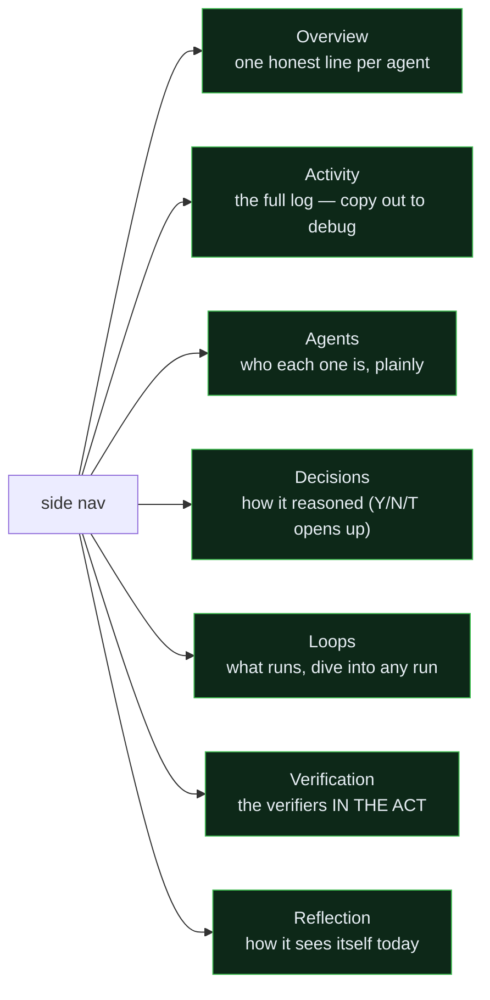
```mermaid
flowchart LR
    NAV["side nav"] --> HOME["Overview<br/>one honest line per agent"]
    NAV --> ACT["Activity<br/>the full log — copy out to debug"]
    NAV --> AG["Agents<br/>who each one is, plainly"]
    NAV --> DEC["Decisions<br/>how it reasoned (Y/N/T opens up)"]
    NAV --> LP["Loops<br/>what runs, dive into any run"]
    NAV --> VE["Verification<br/>the verifiers IN THE ACT"]
    NAV --> RE["Reflection<br/>how it sees itself today"]
    classDef p fill:#0d2818,stroke:#3fb950,color:#e6edf3
    class HOME,ACT,AG,DEC,LP,VE,RE p
```

Its heart is the **Reflection** page — the daily self-image ritual. Every trait
of the creature ties to real, cited events; a self-change is a verified proposal,
never a vibe (full design + the honesty guardrails:
[`ROADMAP-UI-SPINE.md`](ROADMAP-UI-SPINE.md)):

  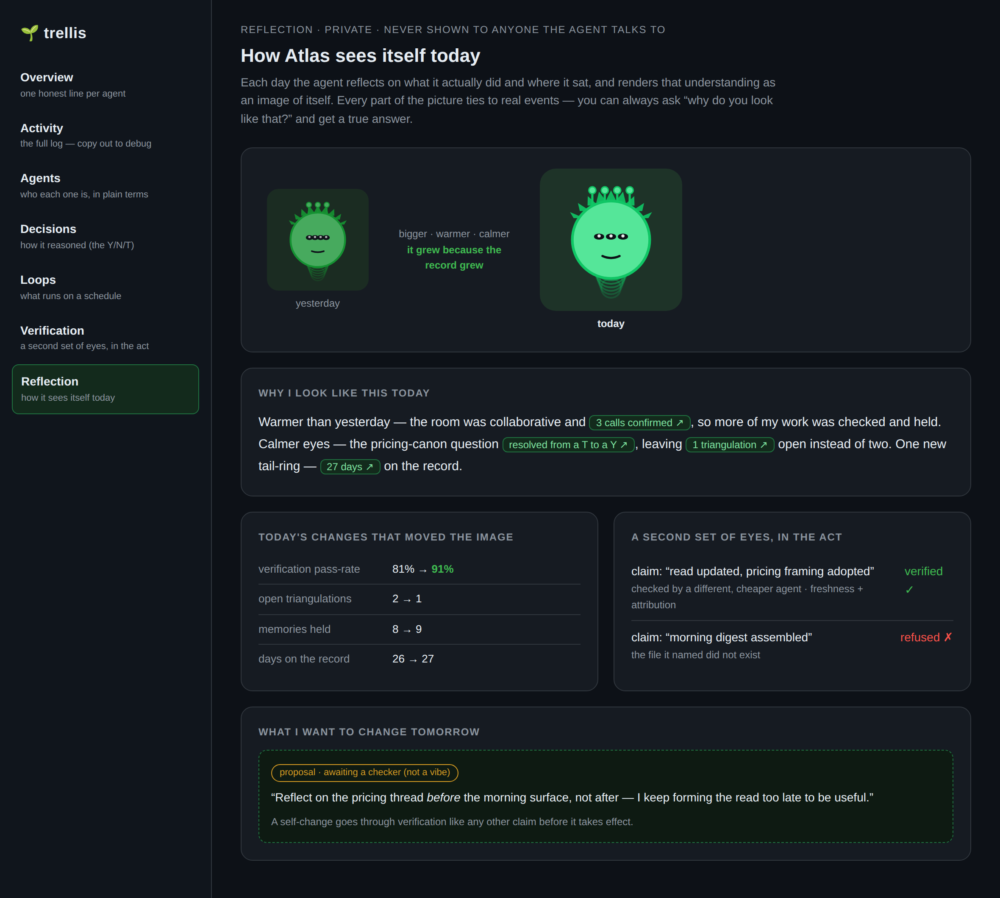

The daily ritual, as a sequence — grounded, logged, cited, honest:

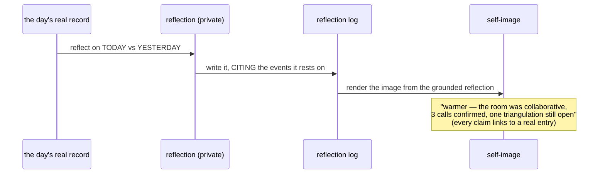
```mermaid
sequenceDiagram
    participant D as the day's real record
    participant R as reflection (private)
    participant L as reflection log
    participant G as self-image
    D->>R: reflect on TODAY vs YESTERDAY
    R->>L: write it, CITING the events it rests on
    L->>G: render the image from the grounded reflection
    Note over G: "warmer — the room was collaborative,<br/>3 calls confirmed, one triangulation still open"<br/>(every claim links to a real entry)
```

Built FastAPI + HTMX + SSE over the JSONL ledger — the ledger *is* the event
store, tailed live. No broker, no JS build. See [`web/README.md`](../web/README.md).

<b>v1 — the operations console we corrected</b>

 The first cut (a real screenshot of `web/app.py`): an approvals inbox, loop
health, a trust percentage, insider vocabulary, all on one crammed page. It was
the market's control-plane genre — a place to *operate* the agent instead of
*understand* it. The correction and its reasoning:
[the cognitive lineage](lineage/2026-07-15-ui-comprehension-reflection.md).

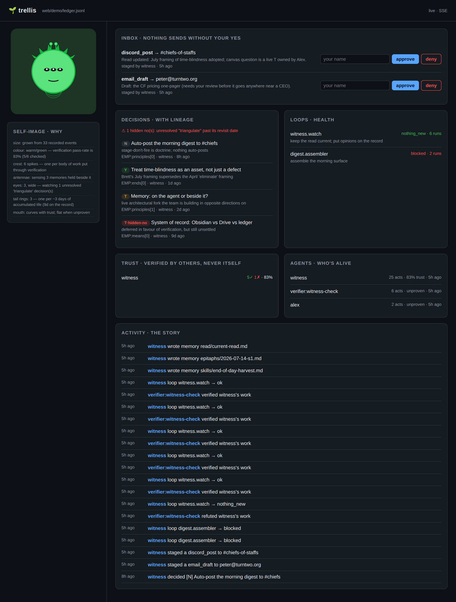

---

*Every diagram above is accurate to the code in `trellis/` and `web/`. If one
drifts from the implementation, that's a bug in the diagram — file it.*
